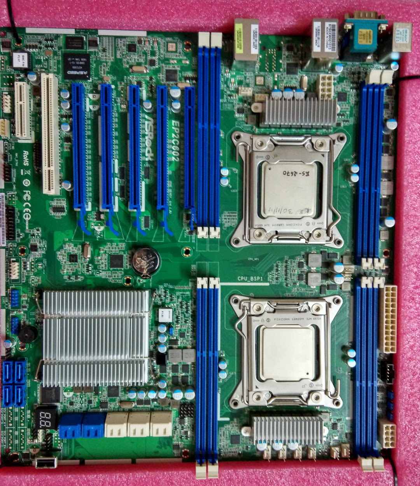
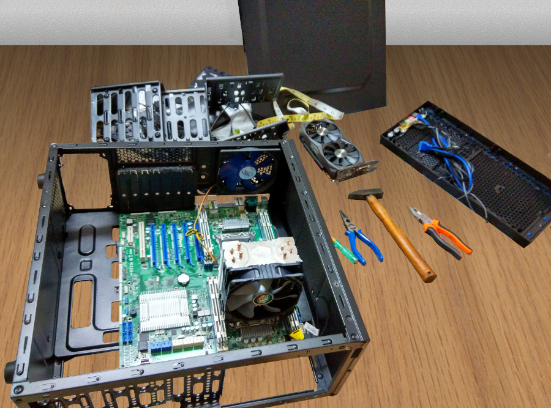
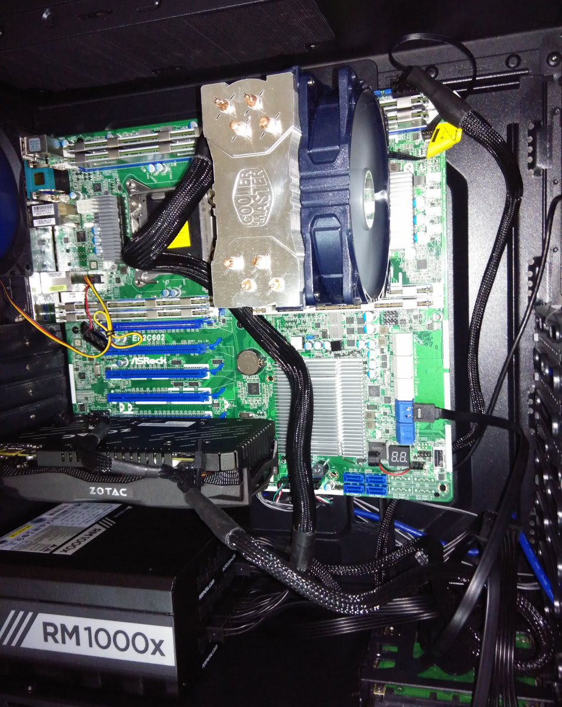
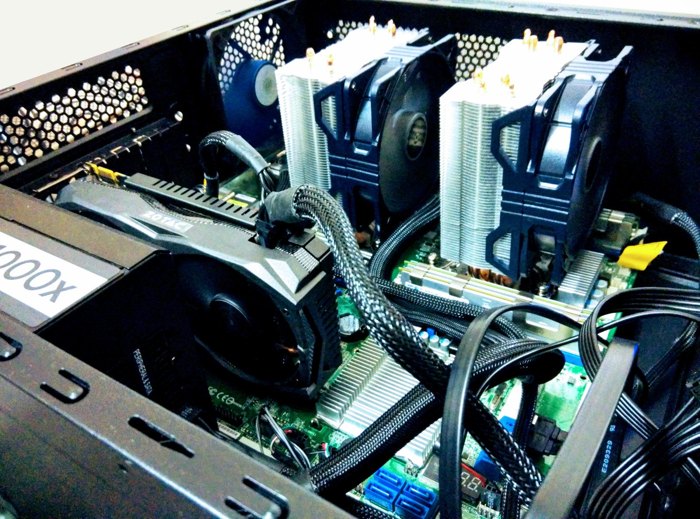
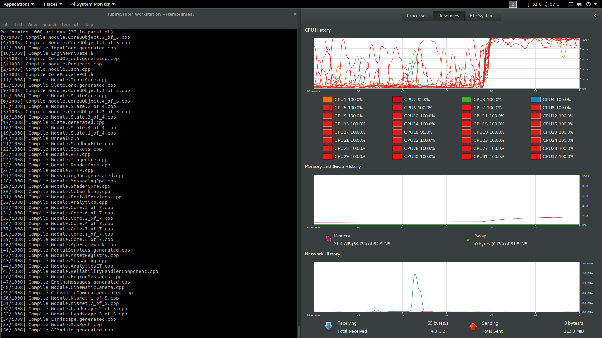

I had been saving since forever to build the ultimate workstation! I have no interest in splurging on the latest and the greatest. Instead, I decided to pick used parts from a few generations ago which provide excellent value for money.

## What This Build is Not

This is not a gaming build (that would be a story for another day!). If you are looking for a build log that ends with photos of a shiny case studded with RGB LEDs, this is where you must stop. This is supposed to be my primary workstation, which will spend its life tucked away in a corner, out of sight. Aesthetics is nowhere on my requirement list.

## What do I Need From my Workstation?
My primary workflows are:

- 3D modeling and animation using Blender and Houdini
- Real-time 3D: Unreal Engine
- Video crunching - ffmpeg, handbrake
- Image processing
- 2+ VMs used for webdev and Android app dev

I often switch between two or more running in parallel. And there is Google Chrome with 20+ tabs, hogging more RAM than everything else put together -.-

I narrowed down the essentials to a minimum of:

- 32 GB RAM
- 8 CPU threads

## Picking the Parts

#### Processor

I love Intel's <a href="http://ark.intel.com/products/80806/Intel-Core-i7-4790-Processor-8M-Cache-up-to-4_00-GHz" target="_blank">i7 4790k</a> chip.
It has some serious firepower with a 4.0 Ghz base clock, turbo boosting to 4.40 GHz! I started scouring the web for a good deal.

Side note about the pathetic state of computer hardware market here in India. First, the options are extremely limited :-/ Good luck finding any used parts. Next, the ridiculous import duties mean processors and graphics cards cost anywhere from 30% - 60% higher than the equivalent price in the US market.

I couldn't find any used 4790k processor. The new one would set me back by INR 27000. Ouch!

Something caught my attention as I was researching processors. A slew of decommissioned Xeon processors seem to have landed on eBay! I found __Xeon E5 2670__
chips selling for about INR 10000 - 14000 each! This was a game changer! Time to go back to the drawing board.
The <a href="http://ark.intel.com/products/64595/Intel-Xeon-Processor-E5-2670-20M-Cache-2_60-GHz-8_00-GTs-Intel-QPI" target="_blank">Intel Xeon E5 2670</a> packs a punch!

- 20 MB cache (woah!)
- 8 cores x 2 threads
- Up to 384GB of RAM (ECC)
- Quad-channel memory
- Supports 2 processor configuration! Oh yeah, now we are talking!

On the flip side:

- Only 2.60 GHz base clock (but boosts to 3.30 GHz turbo boost, which is impressive)
- High TDP: 115W
- Dated Sandy Bridge architecture

> The options in India are extremely limited. Good luck finding any used parts. The ridiculous import duties mean processors and graphics cards cost anywhere from 30% - 60% higher than the equivalent price in the US market.

The prospect of running 32 cores in a dual-CPU config won me over. The days of VMs freezing on me are gonna be a thing of the past! Intel Xeon E5 2670 it is. Two of 'em!

#### Motherboard

The choice of motherboard was a simple but expensive one. The only option available to me was the <a href="http://www.asrockrack.com/general/productdetail.asp?Model=EP2C602#Specifications" target="_blank">AsRock EP2C602</a>. It was gonna be _the_ most expensive part of the build :-|

<Figure caption="AsRock EP2C602">

</Figure>

#### RAM

I was in luck! Stumbled upon decommissioned ECC memory at unbelievable prices! Got myself 8 sticks of 8GB DDR3 1333 ECC memory for a total of 64GB RAM! Bring it on Google Chrome, I dare ya!

#### Graphics card

Another awesome deal, thanks to eBay! A used GTX 960 2GB which barely had any signs of wear! Why only GTX 960? Well, I have no plans to game. Will probably use it for some Cycles rendering. Might rethink and upgrade in future. For now, this should do.

#### Storage
I picked a used Intel 520 Series 180GB SSD off eBay for my boot drive. I should have an old HDD lying around which should come in useful.

#### Power Supply
Ironically, this took me the most time to find. I wanted a modular supply with 2 CPU connectors. Those are rare to begin with. Couldn't find any in a store (physical or online). Eventually, I grabbed a refurbished Corsair RM 1000x off Newegg.

#### CPU Cooler
I had always wanted one of the closed-loop CPU coolers. But I was at the fag end of my budget. Another example of the ridiculous hardware prices in India - the Corsair H100 costs about three times as much as the CoolerMaster Hyper 212X. Ended up settling for the Hyper 212X :-|

#### Case
Uh-oh! Big problem here. The EP2C602 is an e-ATX mobo. None - and I mean it - NONE of the stores had an e-ATX mobo. Also, the case had to be big enough for the Hyper 212X. There were only a few to be found online - at exorbitant prices. My budget was already stretched thin. I couldn't afford spending more than my processor for a tin can :-/

__Alternatives:__

- Build my own eATX case (Aluminium? Wood?)
- Mod an existing case

The first option is far too much work. The second one seems plausible.

The eATX form factor has some matching screw-holes with an ATX mobo. Dimensions of a full-size ATX board are 12 x 9.6 in (305 × 244 mm). My eATX mobo is 12 x 13 in (305 x 330 mm). The extra 2.4 inches overlaps with the optical and hard drive cages in the case. What if I could somehow get rid of all those? Only one way to find out: get one and see if it works.

## Open-Air Build
Once all the parts were procured I started putting them together for a test-build. Half way through the process I realised that I had no monitor! Dang! What a fail! Oh well, I do have a projector. That should do for now.

The LGA 2011 socket is easy to mount. The two retention latches lock down real hard!

The Hyper 212X heatsinks are gigantic and clumsy. In retrospect, this is only about an average cooler. With everything in place, I had to consult the mobo manual to find the right jumpers to short, and the system sprang to life.

#### No Display!
Every system builder's worst nightmare - no display/POST. Dr.Debug gave some clues:
It threw up Q-Code 64 (I looked it up - it means CPU DXE initialization). Well, one or both CPU's had a problem. What could I have messed up?

#### POST!

- Swapped CPUs - no display
- Removed CPU 2 - no display
- Replaced CPU 1 with CPU 2 - Viola! POST! Woot!

__Bad news:__ One of the CPUs was DOA

__Good news:__ Everything else works

Praying that the eBay seller replaces it or issues me a refund. The seller didn't respond to any of my repeated complaints. So, I gave in and ordered another Xeon E5 2670 off Newegg. Well, now that everything is tested to be working, it is time for the final build.

> In retrospect, there were many potential points of failure - especially when almost everything in the build is used/refurbished. I think I got off easy.

__Update 1 (Dec 23, 2016):__ I did hear back from the seller, who asked me to ship the dead processor back to him, following which, he would send me a replacement. I don't have high hopes, though.

__Update 2 (Mar 29, 2017):__ As I suspected, the seller has just been trolling me. Three months later, I still have not received a replacement or refund

## The Build

I picked up an _el cheapo_, no-name ATX case from a store and decided to get cracking with the limited set of tools and upper body strength I possess.

Oh! How I wish I was back in my Dad's workshop. He is kinda the Chuck Norris of metal and wood working!

After a night of cracking rivets open, the hard drive cages were out of the case. Next step was to add some insulated pads for supporting the mobo in places where mounting holes were missing (I don't have a drill machine - so I couldn't add the appropriate mobo stand-offs). Silicone glue + tough rubber pads (scavenged from scrap) left to settle down overnight did the job.

<Figure caption="Modding the ATX case for the e-ATX motherboard">

</Figure>

The mobo fit like a charm! The rubber pads provide supports in the right spots. Next in was the power supply. Wish the mobo power cable was longer. Corsair cheaped out on that one. The build quality of the case is not bad, for a dirt cheap box. It has a couple of front-panel USB 3.0 which I can't use (this is fairly dated architecture and a server mobo, remember?). Also, no on-board audio on the server-class mobo. Will probably add a sound card later.

<Figure caption="Making everything fit in the modded case">

</Figure>

Meanwhile, I managed to buy a used __Dell S2216H__ monitor which has built-in audio, Audio-In and Audio-Out. Just what I need! Don't need an audio card anymore!

With the hard drive cages gone, some improvisation is in order for mounting the SSD (and an old 1TB hard drive I had lying around). Some clever use of zip ties and cable ties did it. Yeah, it won't hold up against the case being tossed around. But this is just gonna sit in a corner, never to be moved. I think it will do just fine.

<Figure caption="Behold! The completed dual Xeon build">

</Figure>

One of the first tasks for my new workstation was building Unreal Engine from source. Watching 32 threads piledrive through the source was oddly satisfying! The job was done in about 10 minutes.

<Figure caption="Building Unreal Engine 4.18 on Ubuntu 16.04">

</Figure>

## Parts List

<table class="table table-bordered table-hover table-striped">
  <thead>
    <tr>
      <th>Part</th>
      <th class="text-center">Qty</th>
      <th class="text-right">Price (INR)</th>
    </tr>
  </thead>
  <tbody>
    <tr>
      <td>Intel Xeon E5 2670</td>
      <td class="text-center">2</td>
      <td class="text-right">21000</td>
    </tr>
    <tr>
      <td>Asrock EP2C602</td>
      <td class="text-center">1</td>
      <td class="text-right">31000</td>
    </tr>
    <tr>
      <td>Samsung 8GB DDR3 1333 ECC</td>
      <td class="text-center">8</td>
      <td class="text-right">14500</td>
    </tr>
    <tr>
      <td>Intel Series 520 180GB SSD</td>
      <td class="text-center">1</td>
      <td class="text-right">3000</td>
    </tr>
    <tr>
      <td>Zotac GTX 960 Amp 2GB</td>
      <td class="text-center">1</td>
      <td class="text-right">12300</td>
    </tr>
    <tr>
      <td>Corsair RM 1000x</td>
      <td class="text-center">1</td>
      <td class="text-right">10800</td>
    </tr>
    <tr>
      <td>CoolerMaster Hyper 212X</td>
      <td class="text-center">2</td>
      <td class="text-right">8000</td>
    </tr>
    <tr>
      <td>Generic ATX Case</td>
      <td class="text-center">1</td>
      <td class="text-right">4000</td>
    </tr>
    <tr>
      <td>Dell S2216H Monitor</td>
      <td class="text-center">1</td>
      <td class="text-right">7000</td>
    </tr>
    <tr>
      <td><strong>Total</strong></td>
      <td class="text-center"></td>
      <td class="text-right">111600</td>
    </tr>
  </tbody>
</table>

