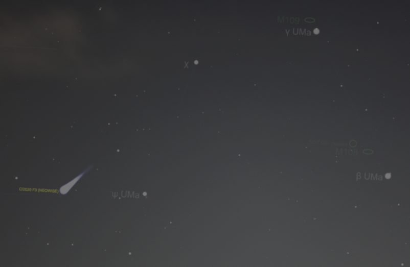
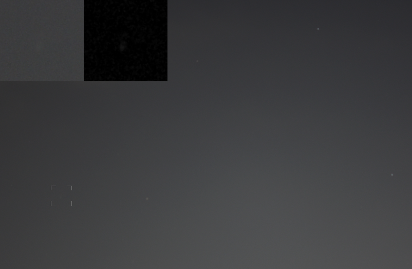
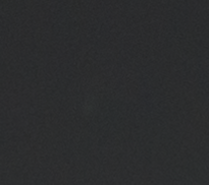
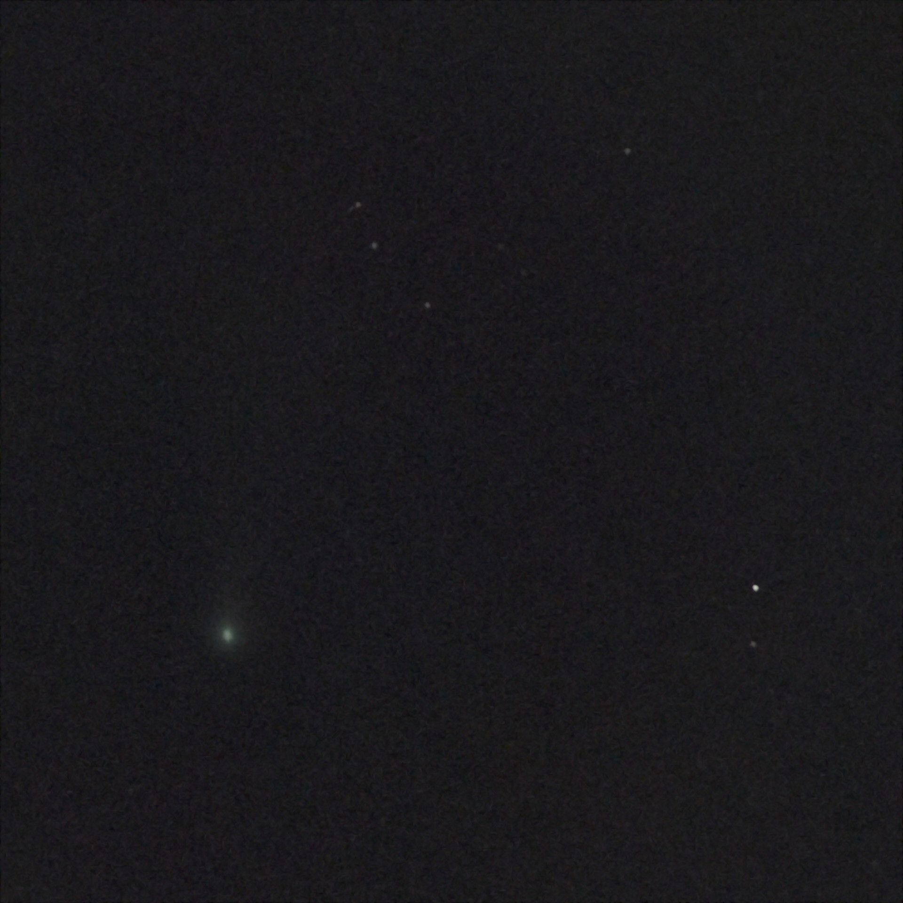

On March 27, 2020, NASA's NEOWISE program used their WISE (Wide-field Infrared Survey Explorer) telescope to discover an object which was classified as a comet and named C/2020 F3, popularly called, Comet Neowise. The comet was at perihelion on July 3, and started on its journey out of our backyard of the Solar System. By early July the comet was bright enough to be visible to the unaided eye. But there was more. It would make its closest approach to Earth on July 23. This sent everyone scurrying to dust off their scopes and cameras!

I have vivid memories of the Comet Hale-Bopp from the Spring of 1997. AFAIK, Neowise is the brightest comet since. The perihelion pass had increased the comet's orbital period from 4400 years to about 6700 years! It might be a stretch, but I don't really expect to be around by then. So, I have been trying to spot the comet since mid July.

## Conditions could hardly be any worse

Where do I even begin! Let's start with the obvious one &mdash; light pollution. I live in an area classified as [Bortle Class 8](https://www.handprint.com/ASTRO/bortle.html). Here is what that means:

 

  <table class="table table-bordered table-striped">
    <thead>
      <tr>
        <th>Class</th>
        <th>Naked-eye Limiting Magnitude</th>
        <th>Sky Description</th>
        <th>Milky Way</th>
        <th>Astronomical Objects</th>
        <th>Zodiacal Light / Constellations</th>
        <th>Airglow and Clouds</th>
        <th>Night Time Scene</th>
      </tr>
    </thead>
    <tbody>
      <tr>
        <td>8</td>
        <td>4.1 - 4.5</td>
        <td>City Sky</td>
        <td>Not visible at all</td>
        <td>Pleiades Cluster visible; very few other objects can be detected</td>
        <td>Only brighter constellations recognizable</td>
        <td>Clouds are brilliantly lit</td>
        <td>Entire sky background has an glow and it is bright enough to read at night</td>
      </tr>
    </tbody>
  </table>

 

On a good night, you'd be lucky to be able to see anything but the brightest stars. Most nights, all I get to see are Venus, Jupiter and the star, Arcturus.

Next, the weather. It is the middle of the Monsoon season in this part of the world. Which means, a near constant cloud cover.

Why don't I just go to a place better suited for astrophotography? That's a great plan. There's just the one problem &mdash; we are in the middle of a global pandemic, and my immediate neighborhood is currently designated as a 'containment zone', meaning, no one goes in or out of a 4-block radius. So much for the prospect of finding darker skies.

## Gotta work with what you got

Stuck in this situation, I decided to give it a shot anyway. For nearly a week since July 14, I scoured the skies at dusk. All in vain. Some evenings were a total washout, thanks to rain. I also tried my luck before dawn. But the comet's elevation was getting too low for line-of-sight visibility.

After ten days with nothing to show for, I changed my strategy. Instead of trying to locate the comet by the naked eye, I took my camera along for long exposure shots. The difference is amazing! With a fast lens, even a 2-second exposure can reveal details indiscernible to the unaided eye.

Right after sunset on July 25, there was a thin layer of clouds, but the camera could see some of the brighter stars. The wind was picking pace and there were a lot more clouds headed my way from the South. My window of opportunity was fast slamming shut. Armed with my fastest lens - the humble 35mm f/1.8, I managed to take a series of long exposure shots of the North West sky, around Ursa Major, before clouds brought the night's session to a close.

My initial plan was to pixel-peep through all my photos. Then it hit me: it should be easier to backtrack my way to the comet's exact location. I shortlisted a couple of my best shots of the night, looked up a sky map of the exact same time as my photo's timestamp and overlaid it on top.

<Figure caption="Unedited photo of the nightsky with a sky map overlay" width={800} unoptimized>

  

</Figure>

Looking at my frame, right under the position of the comet from the map, I found it!

<Figure caption="Comet C/2020 F3 Neowise, as on July 25, 2020, 20:01. Inset 1: 100% crop (unedited). Inset 2: Post processed" width={800} unoptimized>

  

</Figure>

__EXIF: 35mm, f/1.8, 6s, ISO 100__

Behold! At the time of observation (July 25, 20:01) Comet C/2020 F3 aka Neowise was found at __El: 30&#176; Az: 303&#176;__. Note the star, __Psi Ursa Major__ to its right. Also visible: __Beta UMa__ to the right of the frame and __Gamma UMa__ at the top right. These reference points are gonna be immensely helpful in locating the comet again.

<Figure caption="100% crop (unedited). Do you see it?" width={418} unoptimized>

  

</Figure>

As you can see, the visibility is terrible. Without my 'backtracking process' I could never have found that faint li'l blob.

## Improving the results

With the exact location pinned, I dusted off my battered 300mm lens and waited for clearer skies. Clouds dispersed and conditions improved at around 8pm on July 26. I had some trouble fidgeting with the focus and narrow FoV of the long lens. With the coordinates from the previous day, I spotted the comet right away in my camera's image review. There was an unmistakable teal tinge to it! I just had about enough time for a couple exposures before the skies went murky again.

<Figure caption="Comet C/2020 F3 Neowise, as seen on July 26, 2020, 20:27" width={800} unoptimized>

  

</Figure>

__EXIF: 300mm, f/5.6, 8s, ISO 800__

Might not seem like much of a spectacle. What you see here, was the best possible result from my location, without a telescope!

In summary, it is totally possible to detect and photograph objects this bright even in such lousy viewing conditions, without specialized equipment. While they may go undetected by the naked eye, using long exposure shots is a great way to gather more light. Even if you don't have a telescope or a camera, grab a pair of binoculars, get your bearings right and point it at the night sky!

Farewell, Comet C/2020 F3! And thanks for rejuvenating a latent interest of mine!
