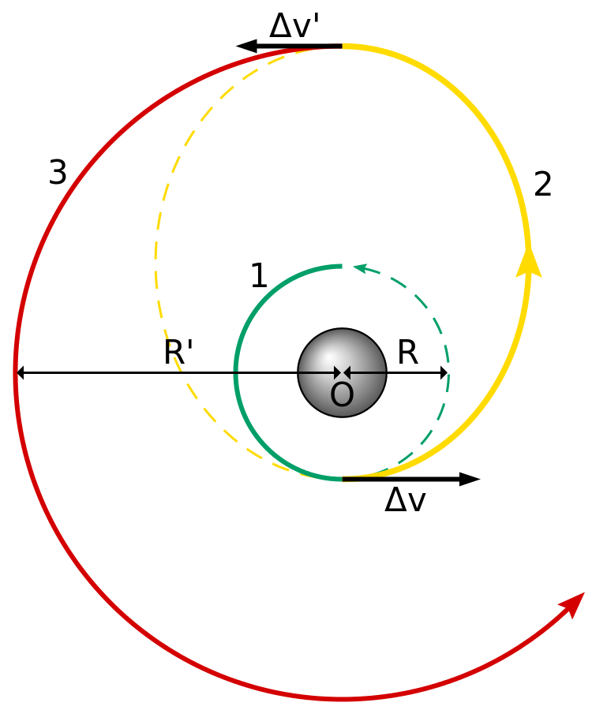

The de-facto maneuvre for transferring a craft from one elliptical orbit to another uses the Hohmann transfer orbit.

<Figure caption="Hohmann orbit to transfer a craft from a lower circular orbit(green) to a higher one(red). The Hohmann path is traced in yellow. It touches both the lower and the higher circular orbit. The transfer path is elliptical in shape">

  

</Figure>

## Ballistic Capture Mechanism

Researchers Francesco Topputo and Edward Belbruno have proposed a new idea — send the craft ahead of time to the orbit of Mars, and wait for planet to swing by. Once captured by Mars' gravity, the craft hitches a free ride.

In their paper published on [arXiv](http://arxiv.org/abs/1410.8856), Topputo and Belbruno state the benefits of this approach. The classical Hohmann method requires thrusters to be fired twice — once for ejecting the craft from the first orbit, and next, in the opposite direction, for slowing it down when it reaches the rendezvous point in the second orbit. This uses up a lot of fuel.

Above all, the timing has to be impeccable. Considering missions to Mars, as example, the orbital and rotation patterns of earth and Mars allow for a brief launch period "window". Missing this means a wait of 26 months for the next attempt! Ballistic capture may be the solution to these problems.

> It's an eye-opener. This could not only apply here to the robotic end of it but also the human exploration end.

Belbruno came up with this idea in 1986, but didn't succeed in initial tests. But in 1991, Japan's failed lunar orbiter, _Hiten_ successfully used ballistic capture to place it back in the lunar orbit. Even though it worked for lunar missions, finding a ballistic transfer path for Mars was deemed impossible/impractical because of the planet's high orbital velocity around the Sun, and the much greater distance from Earth. Earlier this year, Belbruno and Topputo found a path with became the subject of their paper.

### Is it Time to Switch?

For decades, Hohmann's method has been proven to be an effective means for space exploration. Most recently, in September 2014, India's Mars Orbiter Mission (MOM) demonstrated perfect application of this manuevre.

An obvious shortcoming of this technique is that, a spacecraft sent ahead on Mars' orbital path would take longer to get into orbit than one that slows itself down to establish orbit. Nevertheless, there is a definitive possiblity for improvements over the current method. In an interview with [Scientific American](http://www.scientificamerican.com/article/a-new-way-to-reach-mars-safely-anytime-and-on-the-cheap/) James Green, director of NASA's Planetary Science Division said, "It's an eye-opener. This (ballistic capture technique) could not only apply here to the robotic end of it but also the human exploration end."

### The Mars Landing Approach

Is getting to Mars really the problem? It turns out that landing a huge payload on Mars is a much bigger problem which remains largely unsolved! Apparently, most people aren’t aware of this and very few have worried about the details of getting a large, heavy payload to safely descend to the surface of Mars.

The Apollo lunar lander weighed in at approximately 10 metric tons. A modern landing module for a human mission to Mars can easily weigh about six times as much. Landing a payload that heavy on Mars is currently impossible, using our existing capabilities. The atmosphere of mars is much denser than that on the Moon, ruling out landing using propulsive technology. At the same time, there is too little atmosphere on Mars as compared to that on Earth. Which means we can't use airbags or parachutes to land like we do on Earth.

Until someone comes up with an entirely new system, landing humans on Mars sounds like a really scary proposition.

#### Cover Image
_The first true-colour image of Mars from ESA’s Rosetta generated using the OSIRIS orange (red), green and blue colour filters. The image was acquired on 24 February 2007 at 19:28 CET from a distance of about 240 000 km._
_Credits: MPS for OSIRIS Team MPS/UPD/LAM/ IAA/ RSSD/ INTA/ UPM/ DASP/ IDA_
