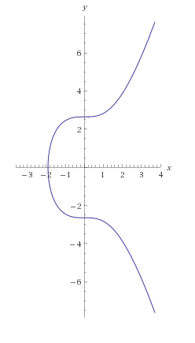

Most Bitcoin implementations skip over the mathematical details - for good reason! The gory details are not for the faint of heart! However, those who dare wade through the myriad equations, gain unparalleled clarity of the underlying concepts. I myself emerged on the other side, marveling at the beauty of the math behind Bitcoin; fascinated by the elegance of the implementation. I wonder why schools never discuss real-world use-cases such as this.

Throughout this article, I will be assuming basic understanding of Bitcoin and the blockchain. If you are new to Bitcoin or the concept of a blockchain, you should rather start off with few of the several non-mathematical treatments available online.


## Ownership of Bitcoin
Bitcoins only exist as “transactions” (transfer of value from one address to another) in the blockchain.  Each transaction can be traced back to one or more transactions where the bitcoins originated - generated by the system. To own a certain amount of bitcoins means possessing the ability to be able to transfer ownership (and hence, the bitcoins themselves) to another address. The sender must create a “digitally signed” transaction, which, if verified by others (the entire network can participate in this process), is added to the blockchain for all of eternity. This is where ECDSA comes in.


## ECDSA
Elliptic Curve Digital Signature Algorithm is used to create digital signatures for data. A digital signature is similar to its real world counterpart - easy to read and identify the owner, but impossible to forge.

ECDSA is based on the mathematical concepts of <a href="https://en.wikipedia.org/wiki/Elliptic_curve" target="_blank" rel="noopener noreferrer">Elliptic Curves</a>
and <a href="https://en.wikipedia.org/wiki/Finite_field" target="_blank" rel="noopener noreferrer">Finite Fields</a>.


## Elliptic Curve
An elliptic curve is of the form:

```
y^2 = x^3 + ax + b
```

### Examples:

<Figure>

  

</Figure>

<Figure>

  

</Figure>

Bitcoin sets `a=0`, `b=7`. Here is how Bitcoin's elliptic curve looks like:

<Figure>

  

</Figure>

## Properties of the Elliptic Curve

1. If a line intersects two points on the curve, it will intersect exactly one more point
1. A line tangent to the curve will intersect exactly one point on the curve

What about vertical lines (slope = INF)? Note that the slope of the elliptic curve goes on increasing beyond the point of inflection (the point where the direction of curvature changes). It can be implied from this that the slope becomes INF at some point. Hence, it can be said that a vertical line intersects the curve at INF.


## Point Addition

Adding two points on the curve, ie: `P1 + P2 = P3`

<Figure>

  

</Figure>

If the line P1 P2 intersects the curve at point P3’ (from property #1 above), then P3 is the reflection of P3’ on the x-axis:

<Figure>


</Figure>

The line `P1P2` is described by:

<Figure>


</Figure>

Where, the slope of the line is:

<Figure>


</Figure>

Plugging the value of y in the elliptic curve equation:

<Figure>


</Figure>

We arrive at a polynomial equation of the third degree. And,

<Figure>


</Figure>

With `x3` known, we need `y3`:

<Figure>

  

</Figure>

__Note:__ The point `P3(x3, y3)` is actually the reflection of `P3’(x3, y3’)`


## Point Doubling

Adding the same point to itself: `P1 + P1 = P2`

<Figure>


</Figure>

The tangent at point P1 intersects the curve at a point P2’ (from property #2). The reflection of point P2’ on the x-axis gives us P2:

<Figure>


</Figure>

We can use the results from point addition:

<Figure>


</Figure>

The slope of the tangent can be found by differentiation:

<Figure>


</Figure>

Hat-tip to <a href="https://www.linkedin.com/in/baidyanath10/" target="_blank" rel="noopener noreferrer">Baidyanath</a>
for helping me understand this part!

## Scalar Multiplication

Multiplying a point P by a number k:

```
R = k * P
```

This can be broken down into a point doubling and addition steps. Example:

```
3 * P
= P + P + P
= P + (P + P)
```

`3P` was thus broken down into one point-addition and one point-doubling step.


## Elliptic Curve in Finite Fields
A finite field is a set of finite elements. To define our elliptic curve over a finite field:

1. Limit values to integers instead of real numbers
1. Compute all results modulo p; where p is a prime number
1. Follow modular arithmetic for all operations

So, if our elliptic curve is

```
y^2 = x^3 + 10x
```

In context of a finite field, with `p = 67`, it becomes:

```
y^2 = (x^3 + 10x) mod 67
```

The plot of the curve changes significantly, but the characteristic properties are retained:

https://codepen.io/schowdhuri/pen/VbVpPR

Note the unmistakable symmetry with respect to `y=p/2`. What previously was a continuous curve is now a set of disjoint points in the xy-plane

https://codepen.io/schowdhuri/pen/LyXrJN

## Parameters of the Elliptic Curve

The elliptic curve is described by certain parameters:

- the elliptic curve equation, defined by the coefficients `(a, b)`
- prime modulo `p`
- base point

Bitcoin uses <a href="https://en.bitcoin.it/wiki/Secp256k1" target="_blank" rel="noopener noreferrer">Secp256k1</a> which sets `a=0` and `b=7` to give us the equation:

```
y^2 = x^3 + 7
```

### Prime modulo
```
  2^256 – 2^32 – 2^9 – 2^8 – 2^7 – 2^6 – 2^4 - 1
  = FFFFFFFF FFFFFFFF FFFFFFFF FFFFFFFF FFFFFFFF FFFFFFFF FFFFFFFE FFFFFC2F
```

### Point of Origin (G)
```
  04 79BE667E F9DCBBAC 55A06295 CE870B07 029BFCDB 2DCE28D9 59F2815B 16F81798
  483ADA77 26A3C465 5DA4FBFC 0E1108A8 FD17B448 A6855419 9C47D08F FB10D4B8
```

## Creating the Private and Public Key pair

The private key is a randomly chosen 20-byte number. The public key is a point on the bitcoin elliptic curve generated from the point multiplication of G with the private key.

```
K(pub) = K(pvt) * G
```

## Signing a message

1. Select a random number k such that `1 <= k <= n-1`
1. Calculate the point P = k * G. That point's x value will represent `R`
1. Calculate `S` like so:

```
S = k^-1 (z + Kpvt * R) mod p
```

Where z is the SHA256 hash of the message, p is the prime modulo, Kpvt is the private key and k is the random number from step 1 above.
`k^-1` is the modular multiplicative inverse of k

The pair `(R, S)` together form the digital signature.


## Verifying a signature

To verify a digital signature `(R, S)`, you need the public key and the curve parameters. Plug the values in this equation:

```
P =  S^-1 * z * G + S^-1 * R * Kpub
```

If the signature is valid, the `x` coordinate of point `P` will be equal to `R`.
