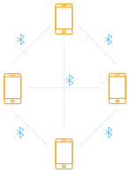

A few weeks ago, I was out on a hike with a couple of my buddies. It was
supposed to be a routine hike, albeit in unexpectedly warm conditions. Things
didn't turn out as planned. One our way back, we got off-tracked on to a false
trail. It kept getting increasingly difficult to push on, with excessive
thorny vegetation blocking our path. I felt, we had gone too far to backtrack,
and decided to continue pushing further (spoiler: it was a bad idea!).

Three hours later, both my arms were bleeding out of a dozen cuts and scrapes.
One of the guys had taken several spills and had hurt his back. Sweltering heat and
dehydration had got to the third guy. We were in the middle of nowhere. With
no supplies or water (it wasn't supposed to be a hike this long; we expected to
be back to our car by this time), we were losing daylight fast, and the area
was not camp-worthy. We decided to do a 180 and head back. Surely, retracing
our steps should be easier.

Wrong, again! Every direction looked the same and we got separated, trying to
find our way back. Such dense was the foliage that we had zero visual contact
between us. Shouting our lungs out was the only way to communicate (no cell
reception!). As we trudged forth, the separation increased, and we were no
longer within an earshot of each other.

To cut a long story short, I managed to get to a point with shaky cell
coverage. I called for help. We were rescued over the next five hours.

## An Idea is Born
Our ordeal got me thinking. What if I could make a communication device to
meet these requirements:

- battery powered, portable
- P2P
- voice comm
- range of 1km+

It would also be good to have:
- internet connectivity
- satellite maps
- GPS location sharing

## Initial Thoughts

Instead of building an entire handheld device from scratch, I feel, it is
easier to use a smartphone, which, I would already have with me on a hike.

> **Update:** <Link to="/projects/mobile-p2p-communicator-part-2">My attempts at long range wifi</Link>

### First Draft: Bluetooth Mesh

A Bluetooth PAN would solve many problems. No additional hardware required.
All we need is a custom app.

<Figure svg>

</Figure>

A quick test exposed the limiting factor - range. Most phones I tested
could manage no more than about 30 meters line-of-sight. The range dropped
to practically nothing when tested in the midst of foliage and vegetation.
Quite the deal-breaker.

### Second Draft: Wifi Mesh
After the Bluetooth debacle, I didn't have much hope from wifi, either.
Nevertheless, I decided to put it through the hoops. For the range test
alone, I kept things simple - started a hotspot on one of the phones
and let others join in.

Wifi didn't do much better. I got about the same range as BT. Surprisingly,
it fared slightly better in the wild - probably because of no interference.
I was able to lock on to the hotspot from about 50 meters away.

None of these solutions come anywhere close to the 1km+ range I require.

### Third Draft: High Power, Directional Wifi

My hunch is that a mobile hotspot doesn't put out enough power for the
range. I am now toying with the idea of setting up a fixed,
'Wifi Base Station', powered by my car battery. The signal would be
beamed forward by a directional antenna.

Some preliminary research indicates that parabolic and yagi antennas can
achieve a range of several kilometers! Here's the setup I have in mind:

<Figure svg>

</Figure>

If the base station is set up at a spot with 4G reception, my network would
have Internet connectivity, too! As you can see, this is no longer a mesh network. Regardless of
the separation between them, as long as hikers are connected to the Base
Station, they can communicate with each other.

Hikers get to use their smartphones. There is no additional hardware required at the receiving end.
Functionality, such as voice comm and location sharing can be built into a custom app.
The separation between hikers doesn't matter as long as they are individually, within the base station's range.
This is a star network. Ergo, comms are not P2P, but routed via the base station.
The fixed base station can be setup at a location with decent 4G coverage, allowing for internet connectivity.
It can be powered off my car battery, or a wall socket, if available.
Such an arrangement should let us put out as much power as we need for the range.
This, in my opinion, is the clincher!

 
Well, that's the plan! I gotta get myself a spare router and a directional antenna.
Can't wait to start tinkering. More to come!

 

**Update:** <Link to="/projects/mobile-p2p-communicator-part-2">My attempts at long range wifi</Link>
