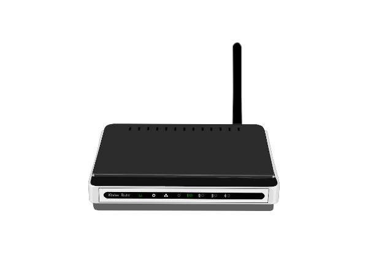
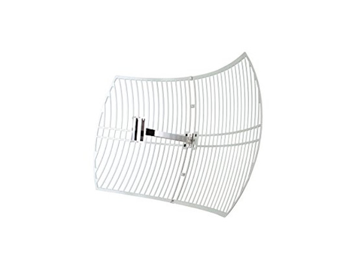
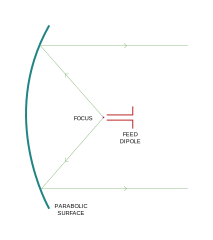
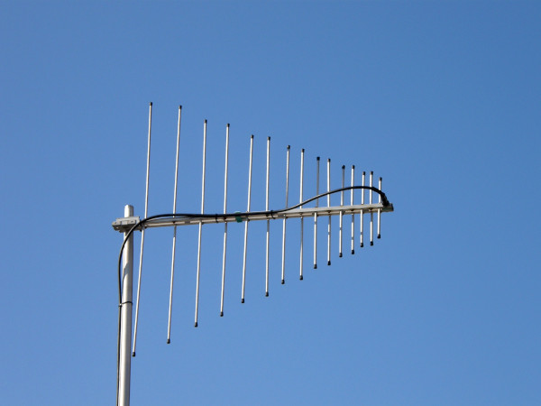
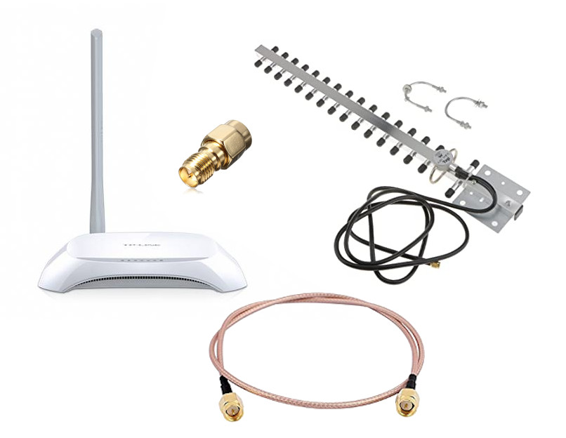
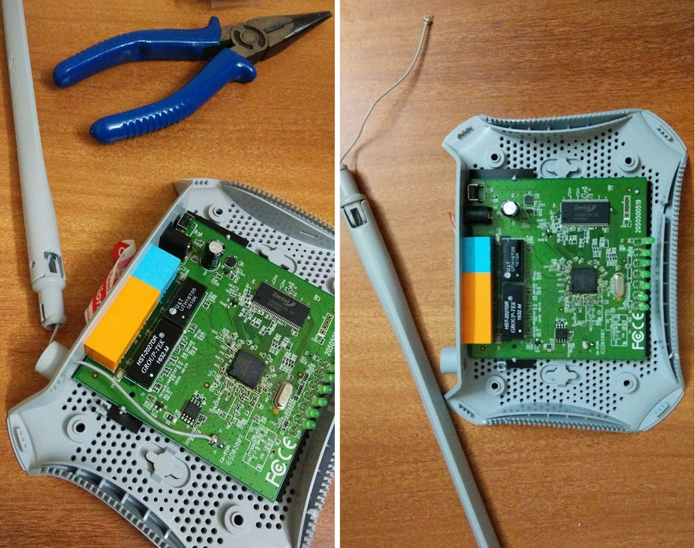
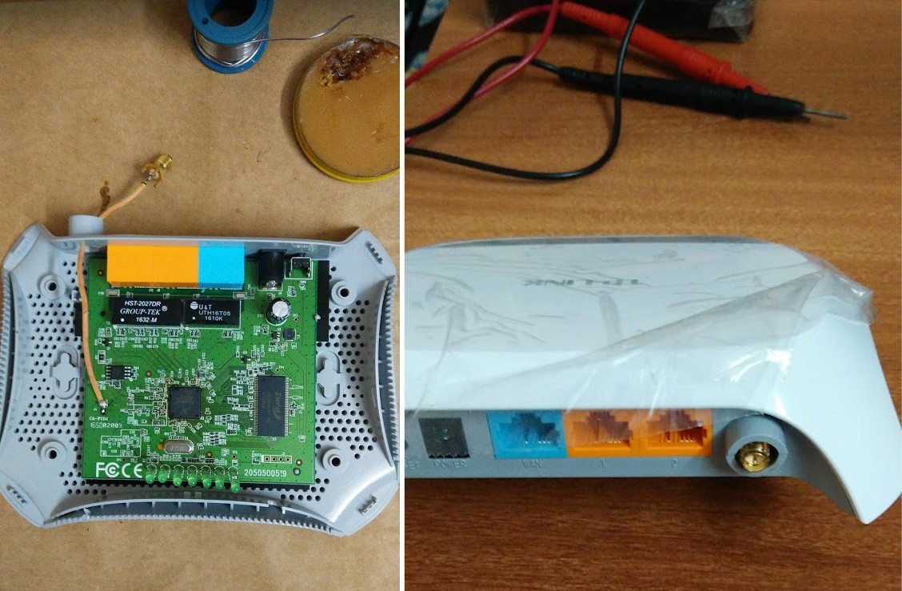
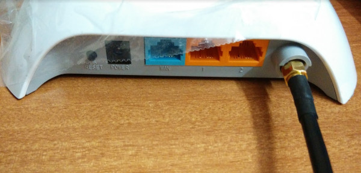
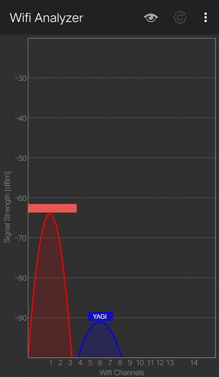

Previously, I <Link to="/projects/mobile-p2p-communicator-part-1">wrote</Link>
about my hiking misadventure that inspired me to start this project.
I have high hopes from wifi as a carrier for my long range radio comm devices.
Before I get too ahead of myself, it would be best to do a range test with a
directional antenna.

## Choosing an Antenna

A quick word about **Antenna Rating**. Antennas are rated with a parameter called Power Gain, measured in decibels (dB), which tells us about its effectiveness compared to that of a standard reference antenna. Manufacturers usually quote a value called dBi for measuring the strength of an antenna. dBi is the gain of an antenna compared to that of an Isotropic radiator (a hypothetical antenna that radiates equally in all directions). The higher the dBi value, greater is the area of coverage.

### Omnidirectional

<Figure>

</Figure>

Commonly seen in home routers and handheld radios. Omni antennas radiate equal
radio power in all directions perpendicular to an axis. Power declines to zero
on the axis. Graphed in 3D, the radiation pattern resembles a donut.

Image: [Wikipedia](https://commons.wikimedia.org/wiki/File:L-over2-rad-pat-per.jpg)

Omni antennas are well-suited to home or office usage, where you might to set it
up in a central location and expect coverage all around. My use case, however,
requires longer range in a _particular direction._ Imagine taking the donut above
and stretching it far, far to the right. That would be a job for a directional antenna.

### Parabolic Antenna

<Figure>

</Figure>

The signal, fed at its focus, gets reflected as a narrow, parallel beam. The beam
spreads very little over distance. Such a collated beam makes it important to 'aim'
the antenna right, or else you might end up in a dead zone.

<Figure svg>

</Figure>

Seems perfect for my use case.

### Yagi Antenna
Originally designed as a radio and TV antenna, the Yagi is often used for 802.11 wifi.
It can provide staggering high signal strength, especially when used outdoors.

<Figure>

</Figure>

The Yagi antenna is very cheap and simple to construct. With the right specs, it can
supposedly achieve terrific signal gain! Downside: the wave pattern is _very_ narrow
and _highly_ directional.

<Figure svg>

</Figure>

Even off by a few degrees, you might find yourself out of the cone.
While at close range, it could be hard to lock on to the Yagi's signal. The coverage
improves over long distances.

I decided to go with the Yagi for my first trial run because it is very cheap and
easily available.

## The Build

Here's the stuff I gathered:

<Figure>

</Figure>

- TP Link TL-WR720N router - literally the cheapest I could find
- Yagi antenna rated 16dBi for 2.4GHz wifi
- RP SMA Connectors
- Shielded cables

### Router Teardown

Cracked the router open and desoldered the omni antenna

<Figure>

</Figure>

Replaced the omni antenna with a male RP-SMA connector via a small stretch of shielded cable.
A dab of steel glue later, the connector fits nicely in the slot for the antenna

<Figure>

</Figure>

Here's the Yagi antenna's SMA cable, connected to the router:

<Figure>

</Figure>

## The Test

I found a location with minimal wifi interference (such places
are getting rarer by the day!) and hooked up my router and yagi setup. The idea is
to use a mobile app called [Wifi Analyzer](http://www.wifianalyzer.info/)
to measure the signal strength as I walk away from the antenna, in the direction
it points.

### Epic Fail!

<Figure>

</Figure>

To my sheer surprise and disappointment, all I detected was a _very_ weak signal, even
while in the same room as the antenna. As I walked out and further away, the signal
dropped fast to ZERO! Several repeated tests turned up with similar results.

At one point, I re-connected the omni antenna that came with the router. It actually
performed better than the yagi!

### Possible Reasons

There has to be something I am doing wrong. My guesses:

1. The router and the Yagi are incompatible. I have some vague memories of the relation between wavelength and dipole antenna length. Though, my  Yagi is rated for 2.4GHz wifi, perhaps the router is 'tuned' to the omni it comes with
1. Faulty Yagi? I measured continuity between the terminals of the Yagi. There is nearly zero resistance between the two! I am no antenna expert, but this doesn't seem right
1. The router doesn't put out enough power for the Yagi. This is a low-end router after all

## What's Next?

This was quite the bummer. I have hit a wall, trying to make the yagi work. My options are:

1. try different yagi/router combinations
1. try a parabolic antenna

More importantly, this failed experiment exposed the massive flaw in my plans - I have
very little theoretical understanding of how antennas and waveforms work. I could use some help
from someone who does. Before I burn through more of my cash on failed experiments,
I should consult with someone who has experience building long range wifi.
Until then, I have no option but to put this project on hold.
