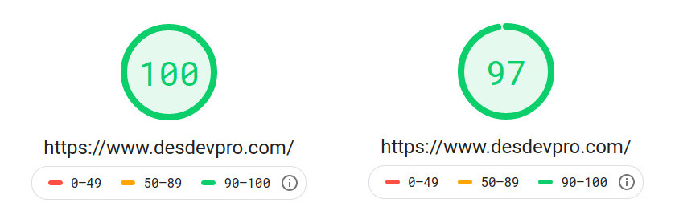

You are now looking at the fourth iteration of this website. In its current avatar, this is a static site, powered by Gatsby. I take a trip down the memory lane, reflecting upon how the tech behind this website has evolved, driven by changing needs, over the past 16 years.

Way back in 2004, I started a consulting business and hacked together a crude website to showcase my work and testimonials. Hand-coded HTML, a little CSS and a lot of tables later, my website was live at  __desdevpro.co.cc__, graciously hosted for free by FreeHostia. Those were simple times! My need for dynamic content grew. I wanted people to be able to send enquiries through the website. Adding PHP was a no-brainer. At the time, I had had my fair share of frustration with the Java stack. PHP felt like a breath of fresh air!

## Quick Markup Language

A big chunk of my clients in the 2004-08 period were doctors, researchers and writers. They wanted to publish their work online _and_ also be able to make changes without reaching out to me for support. At the time, Wordpress was almost unheard of, in this part of the world. Platforms like Blogger/Blogspot/Google Pages were only so customizable. Enter Quick Template Library aka QML - a CMS built to fill the gap. The idea was similar to what Ghost does today - provide a super lightweight WYSIWYG editor for a templating language which compiles to plain ol' HTML. QML's templating language was inspired by BBCode. The USP was, being able to import Wordpad RTF files and convert them to QML templates. The QML engine was written entirely in PHP. To show what QML was capable of, I decided to eat my own dogfood and rewrote the public-facing website in QML.

The Wordpress boom of 2006-2008 made QML obsolete real quick! I moved existing clients over to Wordpress. QML was sunset in late 2009.

## Python/Django

My next paid gig was building a project lifecycle management tool. By then (ca 2008), it was becoming increasingly clear that "web applications" were the future. Having battled the growing pains of maintaining a PHP codebase, I decided to go with Python for this project. Django took a while to grow on me. But once I figured it out, the pieces fell in place and everything started to make sense. With QML on its way out, I ported my website to Django in 2010.

Why have a dynamic website at all? Well, there still was the client-facing SaaS portal behind the scenes, which used PHP. I was terribly strapped for cash, and couldn't afford more servers. I decided to slap on a public frontend on top of the same webapp. Also, I wanted to able to add or modify content and watch it go live instantly.

I ended up building a full-fledged CMS in Django. It had everything I needed:

- WYSISWG content editing
- support for Markdown and Jade (now Pug) templates
- allow guest authors to write content
- image uploads, optimization
- tags, re-indexing
- draft and preview modes

I was quite happy with the result! Thanks to the stability and extensibility of Django, the CMS works well, to this day, with very little maintenance over the _past decade!_.


## Going Static

Over the last couple of years, I haven't really needed a backend. All my projects which needed server-side code are hosted on separate DigitalOcean droplets. Moreover, my needs are far simpler now. I can totally do without WYSIWYG editing, instant publish and modifications. Must admit, I was just being too lazy to drop the backend. In my defense, it still works flawlessly! The final nail in the coffin was - being DDoSed several times over a two-month period. I had CloudFlare up. Or else, the damage could have been much worse.

I explored several options for going static. Hugo stood out for its blinding fast builds. But the templating syntax gives me nightmares! I have been a JavaScript dev for a decade now. Ergo, I chose Gatsby over Jekyll. Also, I have worked with Gatsby before, and its plugin ecosystem is quite mature.

## Building with Gatsby

I recently discovered [MDX](https://mdxjs.com/) and was totally hooked. Gatsby and MDX work extremely work together! The article data and related assets needed some organization. I came up with a custom directory structure for the content:

```
/
└── content
       └── articles
       │     ├── article-1
       │     │   index.mdx
       │     │   Cover.jpg
       │     │
       │     └── article-2
       │             index.mdx
       │             Cover.jpg
       │             another-image.jpg
       │
       └── categories
             ├─── blog.mdx
             └─── projects.mdx
```

Every article would live in a dedicated subfolder under `/content/articles`. Static assets would live alongside the MDX files, and copied over to the `public` folder at build time. An article's attributes are defined as Markdown frontmatter. Here is the schema (for now; subject to change):

```yml
category: blog # must match one of the `catId` values (see Category)
date: "2020-12-12" # ISO date
coverImage: Cover.jpg # Optional
path: article-slug # slug
meta:
  author: Subir Chowdhuri
  description: meta description
  summary: HTML description # HTML supported; used on the category landing page
tags:
  - Hardware # The first tag is used on the landing page
  - Raspberry
title: Title of the post
type: article # must be set to `article`
updated: "2014-12-12" # required; set to the creation date
```

The 'categories' are sections of the blog. They would be defined by respective MDX files inside `/content/categories`. The frontmatter is of the form:

```yml
catId: blog
title: Articles
path: blog
type: category # must be set to `category`
meta:
  description: Blog home # plaintext
  keywords: projects, desdevpro
```

<br />

__Note:__ I expect the frontmatter schema to evolve over time. Check out the [source](https://github.com/schowdhuri/desdevpro.com/) for the current state of affairs.


### Handling Images

Gatsby's plugins do most of the work for me. With very little config, the images are processed into variants of different sizes:
- `gatsby-plugin-sharp`
- `gatsby-remark-copy-images`
- `gatsby-remark-images`
- `gatsby-transformer-sharp`.

There's one catch, though. Remark Images doesn't work on SVGs. I love SVGs! I [rolled my own tiny plugin](https://github.com/schowdhuri/desdevpro.com/tree/master/plugins/gatsby-remark-copy-svg) to copy SVGs from the article subfolders into `/public`.

With everything in place, I content from the old CMS to the new site. It helped that it was markdown to begin with. I dropped guest posts, low quality posts and content older than six years.


## Hosting

This is the easy part. As a static site, desdevpro.com can now be served off a CDN! Since, the source lives on Github, I decided to leverage Github Pages. Considering a push-to-deploy workflow using Github Actions. The results were amazing! Lighthouse scores breached 95. But there was room for improvement. Github Pages doesn't have a way to customize cache headers. Lighthouse complained about the cache TTL being too low. Enter Cloudflare. With Cloudflare in front of my gh-pages endpoint, cache works like a charm. I got near-perfect lighthouse scores. Cloudflare also took care of SSL.

<Figure caption="Lighthouse Scores: Desktop (left) and Mobile">



</Figure>

## Loose Ends

There are some features from my Django CMS which the current setup doesn't. I am not entirely certain if I really need a WYSIWYG content editor. If I do, I might integrate a headless CMS as a data source. NetlifyCMS, or even Wordpress come to mind. Until then, it is a wrap!
