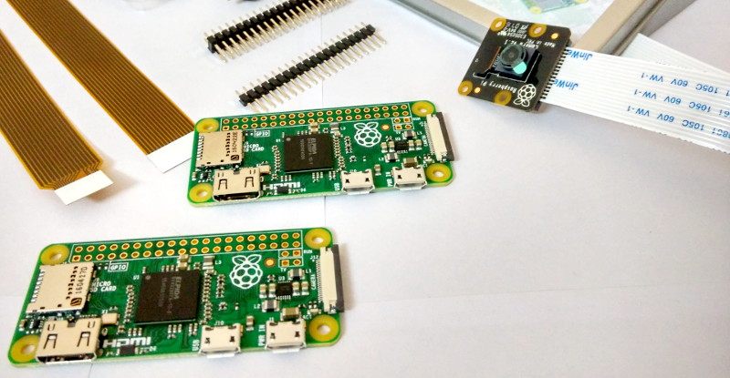
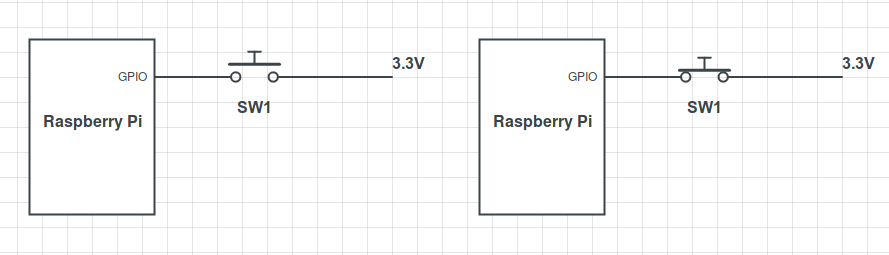
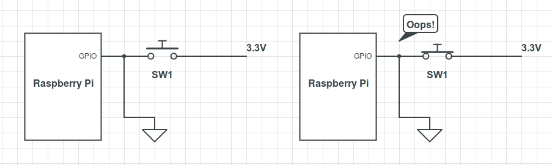
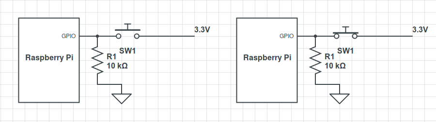
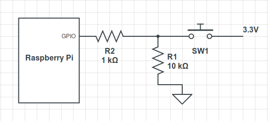
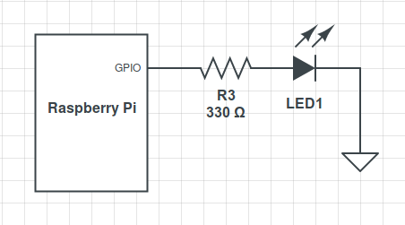
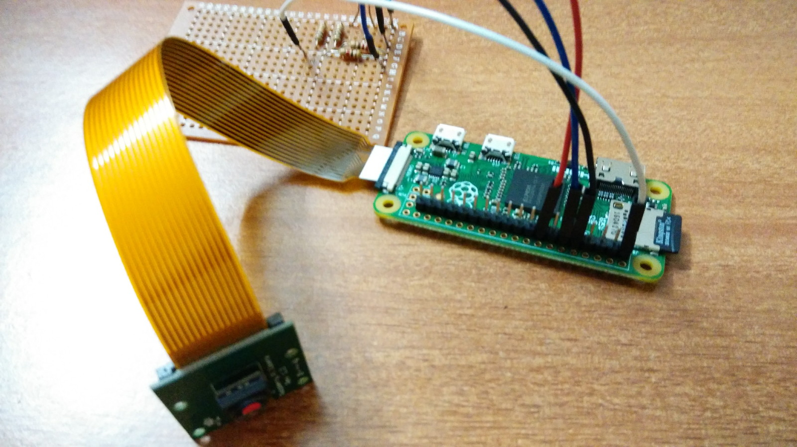
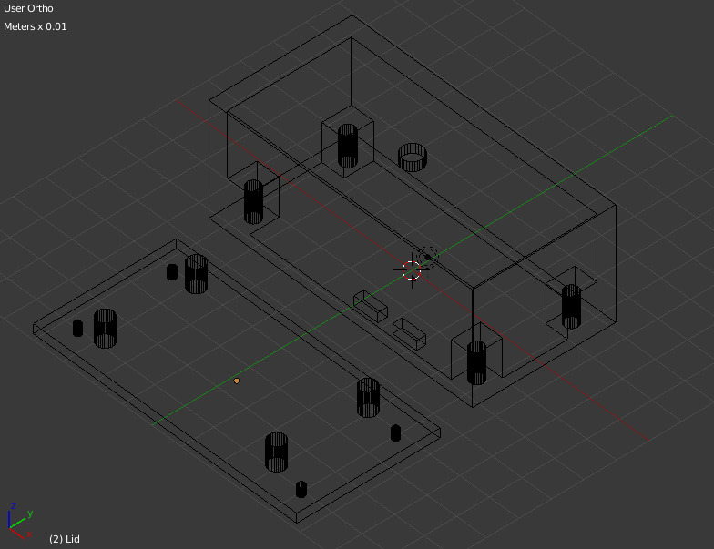
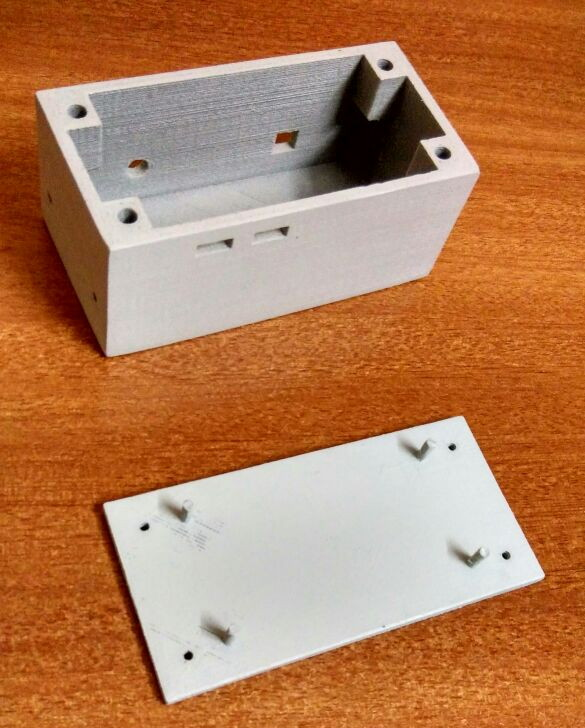
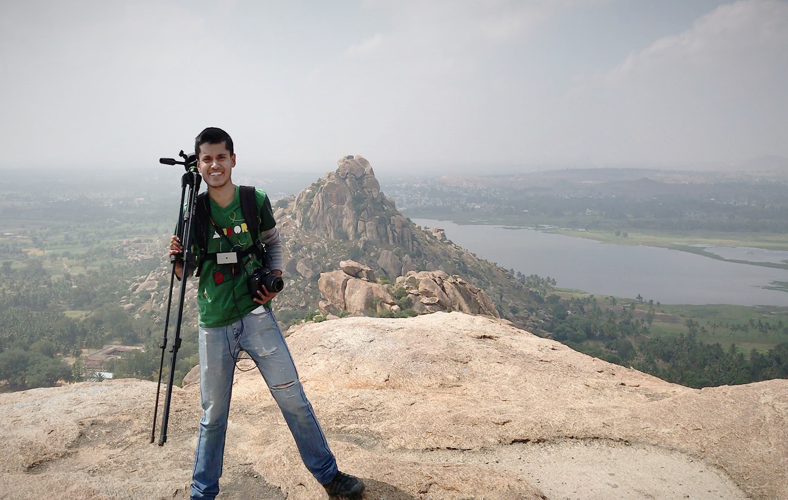

I love hiking and backpacking. While I lug my camera around on hikes, on particularly treacherous trails, I prefer to hold on to my life instead of a camera. Thus, I miss capturing some of the best experiences of a hike. That is how the idea of a DIY action camera was born.

My requirements were simple:

- lightweight, small, robust
- easily strappable to the body
- capture 720p or better video
- cost less than INR 3000 (about US$ 45)

## Design

Decided to go with a Raspberry Pi Camera hooked up to a Pi Zero. I limited the video resolution to 720p to conserve disk space.

<Figure>

</Figure>

Some minimal electronics would also be needed. The camera has to be controlled by a toggle switch. We would also need some kind of recording status indicator:

1. Toggle ON
2. Camera starts recording
3. Status LED turns ON
4. Toggle OFF
5. Camera stops recording
6. Status LED turns OFF

## Toggle Switch

One would imagine that hooking up a GPIO to logical HIGH, ie, 3.3V should work fine:

<Figure>

</Figure>

However, in the open state, the pin is not at logical LOW. It is in an undefined or floating state. This must be prevented by specifically 'pulling the logic level down':

<Figure>

</Figure>

As you may have noticed, this setup has a serious problem - when the switch is closed, the 3.3V is connected straight to ground! We can fix this by adding a resistor in series before the 3.3V source or the ground:

<Figure>

</Figure>

We could stop here, but imagine a situation where this specific GPIO pin is set to output mode due to an error in code. When the pin is closed, we would be sending down 3.3V to an output pin, possibly causing far too much current to flow through the pin. Here is an easy fail-safe:

<Figure>

</Figure>

The extra 1K resistor prevents excess current from flowing through the pin.

## Status LED

When hooking up an LED to a GPIO pin, one must _always_ use resistors in series. The Pi can only supply a small current (~ 60mA). The LED will want to draw more, and if allowed to they can damage the pin or burn out the Pi! Therefore, I add a 330 ohm resistor in series with the LED:

<Figure>

</Figure>

## Software

The code is available on [GitHub](https://github.com/schowdhuri/axn-cam/).
To break it down:

- Set GPIO pin #15 to output mode; this drives the status LED
- Set GPIO pin #11 to input mode; this is used by the toggle switch
- Double flash the LED once the camera is ready to record
- Wait for switch to be pressed; start recording and save to a new file; turn LED on
- Wait for switch to be pressed; stop recording; turn LED off

## Run Script on Startup

The detailed steps I followed to setup the script to run at startup are in the [README](https://github.com/schowdhuri/axn-cam/)

## Open-Air Build

Similar to my PC-building workflow, I did an 'outside the case' test build

<Figure>

</Figure>

The system is powered by a regular 5V battery pack with a microUSB cable.

## The Enclosure

I decided to go full DIY on this - design the enclosure in Blender and get it 3D-printed!

<Figure>

</Figure>

<Figure>

</Figure>

## Finished Build

<Figure caption="That is me, on the first field test of the action camera - it is the little white box strapped to my chest">

</Figure>

## Cost

- Pi Zero: INR 800
- Pi Camera: INR 950
- Electronic components: INR 20
- 3D Printed Case: INR 1200

I just about made it within my budget of INR 3000. If you want to save on costs, you can easily repurpose some plastic container as the enclosure, or build one out of cardboard, wood, what have you.

## Known Issues

The camera is known to 'freeze' while recording. The status LED stays on and doesn't respond to the toggle switch. I have a hunch that this is due to the Pi heating up. I don't know of a workaround yet (except for hard-rebooting the Pi). I haven't had time to debug this (last I checked, there were a bunch of SIGTERMs in the system logs).

## Limitations

1. __Image stabilization:__
The video is quite shaky. I post-process in After Effects to stabilize it.

2. __Low light performance__
Don't expect this to give usable results in dimly lit scenes.

3. __ No Audio:__
Not a deal-breaker for me. I might do a version 2 with audio support.

4. __Aiming the camera:__
You never know for sure what is within the camera's frame. Perhaps, I will add wifi streaming (that will need a Pi Zero W, and will consume far more power)
