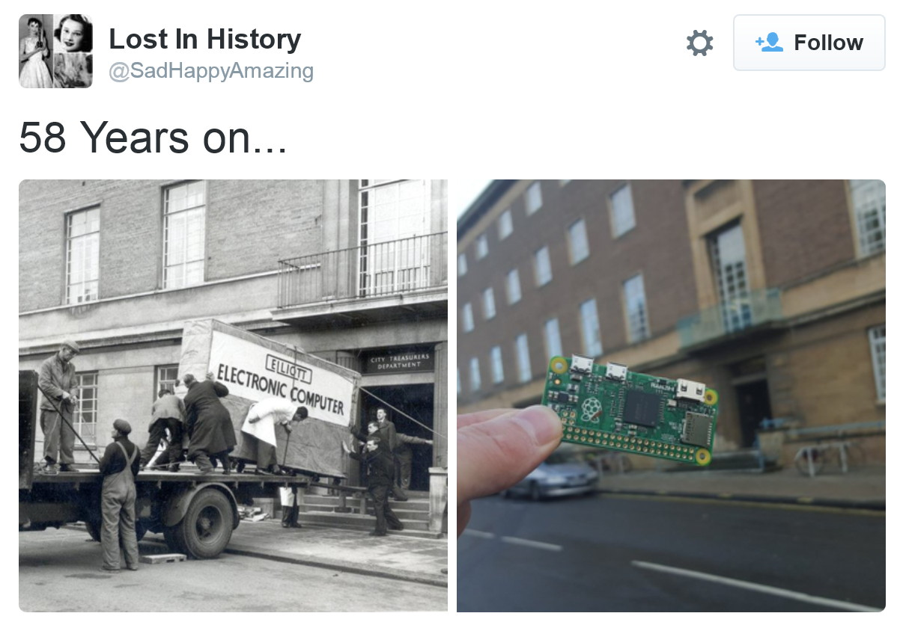

A *smaller and cheaper* Raspberry Pi? Was that even possible? The guys at element14 have made it so! The all new **Raspberry Pi Zero** has a form factor of **65mm x 30mm x 5mm** and sells for, a seemingly impossible US$5 (or £4)! The RPi Zero is probably the outcome of stiff competition from boards like the $9 offering from C.H.I.P.

<iframe src="https://player.vimeo.com/video/146893658" width="100%" height="300" frameborder="0" webkitallowfullscreen mozallowfullscreen allowfullscreen></iframe>

## Specifications

- Broadcom BCM2835 processor
- 1GHz ARM11 core
- 512MB of LPDDR2 SDRAM
- One micro-SD slot
- One mini-HDMI socket
- One micro-USB socket for data/power
- 40-pin GPIO header (unpopulated)

The processor is supposedly faster than that of the original Raspberry Pi by 40%. The pinout is identical to Model A+/B+/2B, and the board runs the familiar Rasbian OS.

Source: [Raspberry Pi Blog](https://www.raspberrypi.org/blog/raspberry-pi-zero/)

Reducing the footprint instead of adding more muscle or bells and whistles was a stroke of genius!

Some people are bound to gripe about the "missing" ports but it is not like the RPi Zero aims to replace the model A or B. This is a completely different form factor based on the principle: you don't have to pay for parts you don't need.

> You don't have to pay for parts you don't need

## Buy a magazine, get a computer free!
Subscribers of the MagPi, a Raspberry Pi magazine, will find a RPi Zero attached to the cover of [issue #40](https://www.raspberrypi.org/magpi/issues/40/) For the first time ever, people can get a computer for free if they buy a magazine!

## Happy Hacking!
Now that we know what lies under the hood, I think this could have been done years ago. The BCM2835 is relatively old processor. It is an ARM11 chip which doesn't find much use outside the Pi space. Nevertheless, I've got to hand it to the RPi Foundation. They've really done an outstanding job creating their product line and getting it out to the masses.

The Pi (and Arduino, and their derivatives) have opened the floodgates, enabling easy entry of software guys into the world of hardware. As a software professional, I don't think I'd have ever returned to my age old hobby of circuit design or hardware hacking until I brought a RPi B and Arduino Uno.

#### Update (Dec 7, 2015)
Someone on twitter posted this:

It is the RPi Zero compared to the Elliott 405 computer from 1957. Both photographs taken in front of the Norwich City Council Treasurer's Department building. [Read this](http://www.spinellis.gr/blog/20151129/) for a spec-by-spec comparison.
