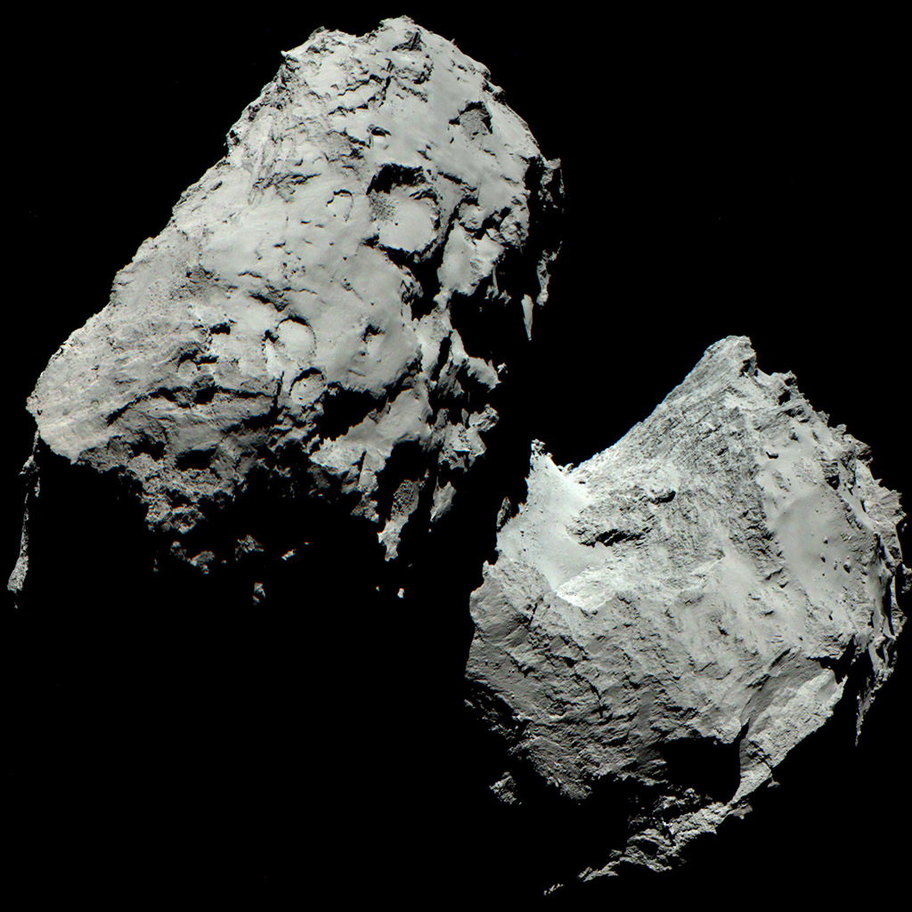

The OSIRIS imaging system aboard the Rosetta orbiter has beamed back one of the first 'true color' images of the comet 67P.

<Figure caption="You are looking at the first ever color image of a comet. Image Credits: ESA/Rosetta/MPS for OSIRIS Team MPS/UPD/LAM/IAA/SSO/INTA/UPM/DASP/IDA">

</Figure>

## Wait, Where's the Color?

It does seem like a grayscale image, but it was composed of three images taken with the _Narrow Angle Camera (NAC)_ of the OSIRIS imaging system aboard the Rosetta orbiter. One image each was taken using the red _(744 nm wavelength)_, green _(536 nm)_, and blue filters on 6 August 2014 from a distance of 120 kilometres from the surface of 67P.

> Principal Investigator Holger Sierks from the Max Planck Institute for Solar System Research (MPS) says, _"As it turns out, 67P/C-G looks dark grey, in reality almost as black as coal."_

Creating the composite is no run-of-the-mill photoshop job! It must be noted that the orbiter (and the comet) was in motion, causing the camera perspective to vary from one image to another. Superimposing the images, accounting for these variations is a tedious process. That is probably why ESA could release the finished images only today.

## What's Next for the Mission

The average grey color of the surface means that it is covered with some kind of dark dust. OSIRIS will try out more combinations of its 25 filters to find out the composition of this 'dust'.
