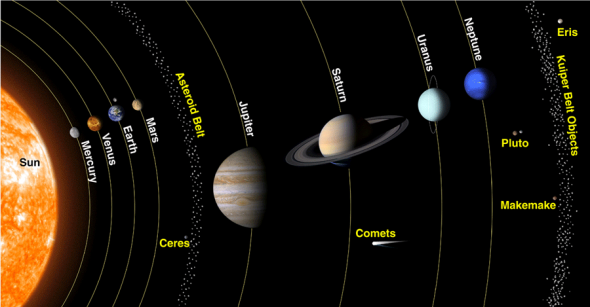

The Rosetta "mothership" has an instrument called **Rosina**. It consists of two mass spectrometers which can analyse the gases which stream off the comet's surface. The analysis of the data gathered by this instrument shows that a comet like 67P could not have brought water to Earth.

## The 'Signature' of Water
Occasionally, a Hydrogen atom in water can change into an isotope, called [Deuterium](http://en.wikipedia.org/wiki/Deuterium). The resultant water molecule, called *heavy water*, has the same chemical properties as 'regular' water, but has greater mass. On an average, water on Earth has been observed to have **three deuterium atoms per 10, 000 water molecules**. This ratio can be thought of as the *signature* of water on Earth.

Rosina's principal investigator, Prof Kathrin Altwegg says, "This ratio between heavy and light water is very characteristic. You cannot easily change it and it stays for a long time. If we compare the water in comets with the water we have on Earth, we can definitely say if the water on Earth is compatible with the water on comets."

The water from comet 67P was found to have three times the concentration of deuterium, compared to that of Earth. This is definitive proof that a comet *similar to* 67P couldn't have seeded the water on Earth.

## Don't Write-off Comets Yet

It is possible that other comets, carrying water crashed into Earth. Researchers say it is too early to rule out the comet theory, and more data is needed.

Only two comets from the [Kuiper Belt](http://en.wikipedia.org/wiki/Kuiper_belt) have been studied till date - 67P and Hartley 2. Interestingly, the water profile of Hartley 2 was found to be a close match to that of Earth. However, with only two data-points, nothing conclusive can be determined, yet.

Moreover, Rosina only analyses the gases ejected from the comet. The hydrogen-to-deuterium ratio can possibly change as the gas escapes the surface. The lander module Philae did manage to run some tests on the ice on the surface before going into hibernation. That data will provide further insight into the composition of matter at the surface of 67P.

### Wasn't Earth 'Born' With Water?

It may seem logical that Earth was here all along, ie, since the very formation of the planet. There are two theories which rule out this possibility. First, a newly-formed Earth would have been extremely hot, causing any water it had to "boil-off". Next, Earth is believed to have suffered a major impact, perhaps from an asteroid or comet, which ejected a part of it, which we now see as the moon. If the Earth already had water/ice at that point of time, the moon would also have traces of water now.

These theories lead to the conclusion that water was brought to Earth at a much later point in history.

### It May Have Been Asteroids

Meteorite fragments from asteroids have been studied for decades. Spectroscopic analysis has shown that the water profile of asteroids closely resembles that of Earth. The Rosetta findings have sparked off new interest in asteroids, for they might have been the actual source of water which covers most of Earth today.
