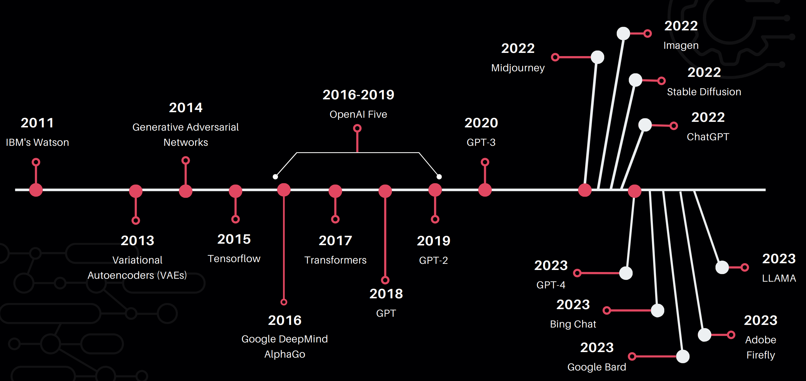
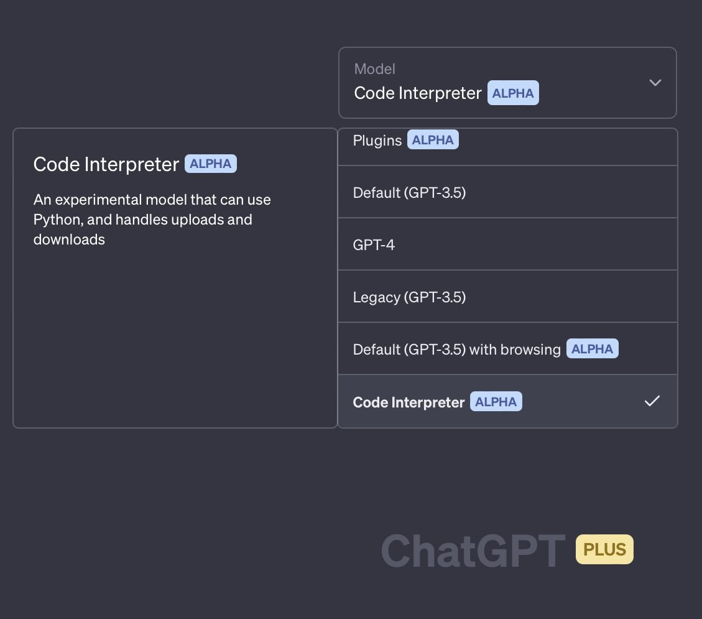
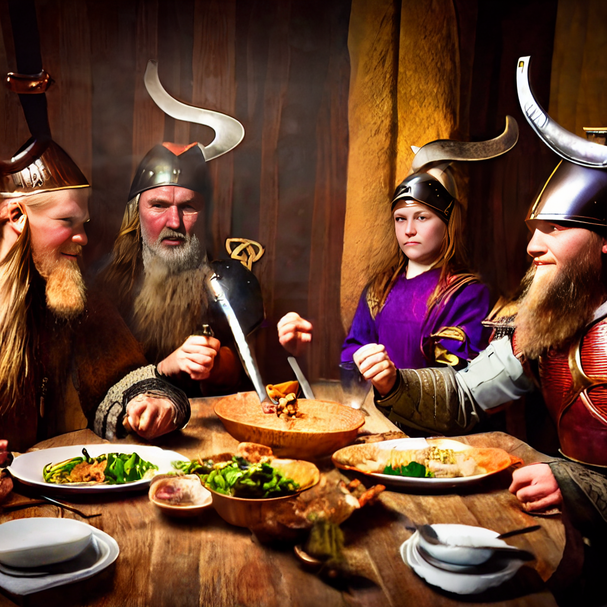
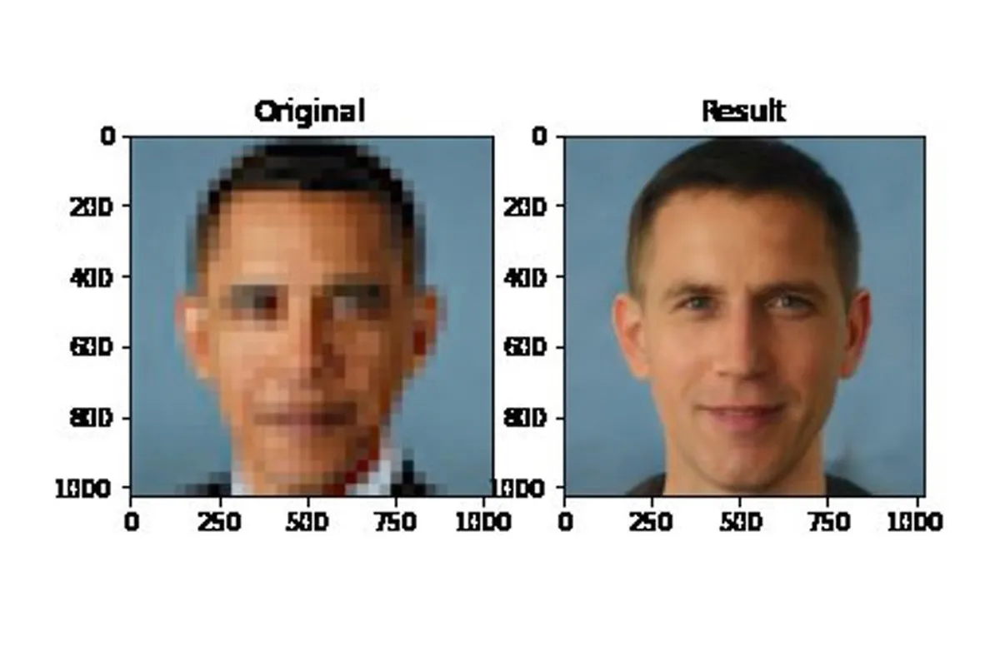
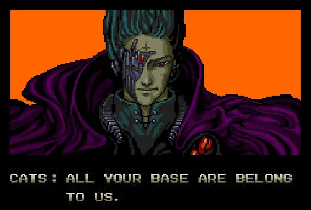

Today, I'm going to talk about the rapidly growing field of generative AI technologies.
My intent is not to dive deep into the underlying technology under the hood but to give you a high-level overview of the field and its applications.
I'll also talk about the ethical implications of these technologies and how we can use them responsibly.

Note: The contents of this article are based on my presentation titled "The AI Renaissance: Rise of Generative AI Technologies" at the Decrew IT Conference, India on May 6, 2023.

## Outline

- Timeline of Modern AI
- Key Advancements
- What's Driving the Current AI Boom?
- Live Demo and Showcase of up and coming tools
- Applications and Impact of AI
- Ethical Considerations and Challenges

---

## Timeline of Modern AI

<Figure>



</Figure>

I know, I know, this is dense with information. Let me break down the key events for you.

- **IBM Watson** won Jeopardy in 2011. This was a big deal because it was the first time a computer beat humans in a game of Jeopardy.
- In 2015, **TensorFlow** was released by Google. Ever since, Tensorflow has been a crucial tool for developers to build and train neural networks.
- In 2015-2016, **Google DeepMind's AlphaGo** beat champion Go players. Go is a much more complex game than chess. It has more possible moves than there are atoms in the universe!
- **Transformers** were introduced in 2017. Transformers are a type of neural network architecture that assigns levels of importance to different parts of data. _Learning_ which is the important part and which isn't depends on the context.
- Not many people know about [OpenAI Five](https://openai.com/research/openai-five). The OpenAI Five project was a team of five neural networks that played Dota 2. Dota 2 is a complex RTS game with many possible moves. The OpenAI Five team beat the world champions in 2018. It attained a win rate of 99.4%! The learnings from OpenAI Five paved the way for GPTs.
- 2018, 2019 and 2020 saw the release of **GPT, GPT-2 and GPT-3** respectively. Each of them were the most advanced AI models of their time.

Now, I'm sure you have noticed that the timeline gets particularly crowded as we approach 2022-23. That's because the field of AI is growing at an exponential rate!

- **MidJourney**: a diffusion model that generates images based on text descriptions
- **Imagen**: a text to image generator from Google's research labs
- **Stable Diffusion**: an Open Source project that allows you to generate images from text descriptions. It's a lot like MidJourney but it's open source and you can run it on your own machine! It is probably the first open source project that allows you to do that.
- **ChatGPT**: In my opinion, this is where AI broke out of computer labs and went mainstream. ChatGPT made GPT accessible to everyone. After all, it's jsut a chatbot that can have a conversation with you.
- **GPT-4** landed in March 2023. It's the most advanced AI model to date. It's also the most expensive AI model to date. It costs \$1.6 million to train GPT-4. It's also the largest AI model to date. It has 1.6 trillion parameters. That's 10x the size of GPT-3!
- Microsoft released **The New Bing** - an AI search powered by GPT-4 in March 2023
- Google went into panic mode and rushed out **Google Bard** in March. It ran into issued even before the launch. Are you familiar with NASA's James Webb telescope? In a Google Bard ad campaign Bard was seen saying something along the lines of 'JWST took the first ever photos of exoplanets'. That's not true.
- In April, 2023, Meta (Facebook) did a closed release of their large language model called **LLAMA**. It was leaked online and is now available on the internet. That spurred an entire cottage industry of AI models that are trained on the LLAMA dataset. Meta has been trying to take down these models but it's a losing battle. But hey, Meta inadvertently triggered the biggest gold rush in the LLM space! In my opinion, this is the most exciting development in the field of AI in 2023.
- Adobe came out with **Firefly** in late April. It's another text-to-image generator and a rival to commercial offerings like DALL-E

---

## Common Factors

If you take a step back and go over that timeline again you'll see that there are some common elements between the most recent advancements in AI tech. Many or perhaps most of the tools we just talked about are built on one of these AI models:

### Transformer Model

- Utilize "self-attention mechanisms" to process and generate sequences of data
- Highly effective in capturing long-range dependencies and context.
- Transformers were originally built for for NLP, but they have are also used for computer vision, graph-structured data, etc

### Large Language Model

- Subset of transformer models that are trained on vast amounts of text data for NLP tasks
- These models learn to generate text by predicting the next word in a sequence, given the context of the preceding words.

Further Reading: [How GPTs Work](https://confusedbit.dev/posts/how_does_gpt_work/)

### Diffusion Model

- Based on the principles of diffusion processes, which involve modeling the data generation process as a series of Markovian noise-driven steps.
- This approach allows the model to learn how to generate or manipulate images by iteratively adding or removing noise from the data.

---

## What's Driving the Current AI Boom?

I'm sure you must have asked yourself this question. Why is AI growing so fast? What's driving this boom? And why now?

It all boils down to a few very simple things:

- Availability of Large Scale Datasets
- Vastly Improved Computing Power
- Novel Algorithmic Innovations

Let's talk about each of these in turn.

### Availability of Large Scale Datasets

Data is the fuel that powers AI. The more data you have, the better your AI model will be. It's as simple as that.
And we have more data than ever before. We have more data than we know what to do with.
We have more data than we can process. We have more data than we can store. We have more data than we can even comprehend.

There are several companies that are in the business of collecting data. They collect data from all over the internet and sell it to companies that need it.

Additionally, there are open source datasets that are available for free. These datasets are used by researchers and companies to train their AI models.

Check out this list of open source datasets:

- [Common Crawl](https://commoncrawl.org/) - A massive web crawl dataset that has petabytes of data collected over the last decade.
- [ImageNet](https://image-net.org/)
- [Wikipedia Dumps](https://dumps.wikimedia.org/) - The complete text and metadata of Wikipedia articles in various languages.
- [Project Gutenberg](https://www.gutenberg.org/) - A collection of over 60,000 public domain books in various formats and languages.
- [BookCorpus](http://yknzhu.wixsite.com/mbweb) - A dataset containing over 11,000 books in various genres from the web, with a focus on fiction.
- [OpenWebText](https://github.com/jcpeterson/openwebtext) - A dataset that is an open-source recreation of the WebText dataset used for training OpenAI's GPT-2 language model.
- [The Enron Email Dataset](https://www.cs.cmu.edu/~./enron/) - A collection of over 600,000 emails from the Enron Corporation, useful for various NLP tasks.
- [Reuters News Archive](https://archive.reuters.com/) - A collection of news articles from Reuters spanning several decades.
- [IMDB Movie Review Dataset](http://ai.stanford.edu/~amaas/data/sentiment/) - A dataset of 50,000 movie reviews, useful for sentiment analysis and other NLP tasks.
- [Yelp Dataset](https://www.yelp.com/dataset) - A dataset of user reviews, business attributes, and other metadata for various businesses, useful for NLP and machine learning tasks.
- [Amazon Reviews](http://jmcauley.ucsd.edu/data/amazon/) - A dataset containing millions of product reviews and metadata from Amazon, useful for sentiment analysis and other NLP tasks.
- [arXiv Dataset](https://www.kaggle.com/Cornell-University/arxiv) - A dataset containing the full text and metadata of articles from the arXiv preprint server, useful for NLP and machine learning tasks.
- [Stack Exchange Data Dump](https://archive.org/details/stackexchange) - A collection of data dumps from various Stack Exchange sites, including Stack Overflow, useful for NLP and machine learning tasks.
- [Open Images](https://storage.googleapis.com/openimages/web/index.html)
- [Google Dataset Search](https://datasetsearch.research.google.com/)
- [Kaggle Datasets](https://www.kaggle.com/datasets)
- [UCI Machine Learning Repository](https://archive.ics.uci.edu/ml/index.php)

**Food for thought:** Have you ever thought about all the photos stored in Google Photos or Facebook, Instagram, Adobe Cloud, apparently for free?
How do you think it benefits these companies to store all these photos for free?

### Vastly Improved Computing Power

The second factor that's driving the AI boom is massive improvements in compute power.

> Since 2012, the amount of compute used in the largest AI training runs has been increasing exponentially with a 3.4-month doubling time (by comparison, Moore’s Law had a 2-year doubling period). Since 2012, this metric has grown by more than 300,000x (a 2-year doubling period would yield only a 7x increase)

https://openai.com/research/ai-and-compute#addendum

#### Graphics Processing Units (GPUs)

GPUs, initially designed for rendering graphics, have become essential for accelerating AI workloads. Their parallel processing capabilities enable efficient handling of large-scale matrix and tensor operations, which are common in deep learning. NVIDIA's CUDA platform, for example, has allowed developers to harness the power of GPUs for AI applications easily.

#### Tensor Processing Units (TPUs)

TPUs, developed by Google, are application-specific integrated circuits (ASICs) designed specifically for deep learning tasks. They offer high performance per watt and can accelerate matrix multiplications and other tensor operations, making them well-suited for training and inference in AI models.

#### Custom AI accelerators

Many companies are developing custom AI accelerators, such as **NVIDIA's A100 Tensor Core GPU.** These specialized hardware solutions offer high performance, low latency, and energy efficiency, enabling researchers and engineers to train and deploy large-scale AI models faster.

#### Cloud-based AI services

Major cloud providers like AWS, Google Cloud, and Microsoft Azure offer AI-focused services and infrastructure, including pre-configured instances with GPUs or TPUs, scalable storage, and easy-to-use machine learning platforms. These services lower the barrier to entry for AI development and facilitate rapid experimentation and deployment of AI models.

### Novel Algorithmic Innovations

The third factor that's driving the AI boom is breakthroughs in new algorithms.

#### Deep Learning

Deep learning, a subset of machine learning, uses artificial neural networks with multiple layers to model complex patterns and representations in data. The success of deep learning in a wide range of applications, such as computer vision and natural language processing, has been a major driving force behind the AI boom.

#### Convolutional Neural Networks (CNNs)

CNNs are a type of deep learning architecture that are particularly effective at processing grid-like data, such as images. The introduction of CNNs has revolutionized the field of computer vision, enabling breakthroughs in tasks like image classification, object detection, and segmentation.

#### Recurrent Neural Networks (RNNs) and LSTMs

RNNs are a type of deep learning model designed to process sequential data. Long Short-Term Memory (LSTM) networks, a variant of RNNs, have been particularly successful in tasks such as machine translation, speech recognition, and time-series prediction, thanks to their ability to capture long-range dependencies in sequences.

#### Transformers

Introduced by Vaswani et al. in 2017, transformers are a deep learning architecture that improves upon RNNs and LSTMs for processing sequential data. They use self-attention mechanisms to capture dependencies in sequences more effectively and enable parallel computation, making them more scalable for large-scale applications.

#### Generative Adversarial Networks (GANs)

As mentioned earlier, GANs consist of two neural networks—a generator and a discriminator—that are trained together in an adversarial process. GANs have spurred growth in AI technologies by enabling the generation of highly realistic synthetic data, with applications across various domains like art, design, gaming, and more.

#### Reinforcement Learning (RL) Algorithms

RL is a type of machine learning where an agent learns to make decisions by interacting with an environment, receiving feedback in the form of rewards or penalties. Breakthroughs in RL algorithms, such as Deep Q-Networks (DQN), Proximal Policy Optimization (PPO), and Monte Carlo Tree Search (MCTS), have led to significant advances in areas like robotics, autonomous vehicles, and game playing.

#### Transfer Learning and Pre-trained Models

Transfer learning is a technique where a pre-trained model, often trained on a large dataset, is fine-tuned for a specific task using a smaller dataset. The introduction of pre-trained models, such as BERT for natural language understanding and ResNet for image classification, has accelerated the development of AI applications by reducing the need for large amounts of labeled data and extensive training.

---

## Demo 1: LLMs

### ChatGPT

Needs no introduction! Here are some interesting prompts to try:

1. Generate fully functional user interfaces using HTML and CSS
```
create a sign in form using html and tailwind css. it should accept an email and password. give me only the code in a code block. do not explain your response
```

2. Get book, movie or song recommendations
```
suggest two books that are similar to the book "the lord of the rings" by j.r.r. tolkien. give me only the titles of the books. do not explain your response

i want to watch a movie. suggest 4 movies of the sci-fi genre. the movie runtime should be less than 150min. give me only the title of the movie. do not explain your response

i want to listen to some music. suggest 4 songs of the progressive trance genre. the song runtime should be less than 5min. give me only the titles of the song. do not explain your response
```

3. Generate a list of ideas for a startup
```
i want to start a startup. suggest 4 startup ideas that require less than $1000 to start.
```

4. Make travel plans
```
my budget is $1500. i want to take a week long next month. i want to travel to a place with warm climate. i am interested in history, archaeology, nature hiking trails and food. above everything else, the destination should have a low crime rate. given these conditions please suggest 4 countries that i can travel to. for each country create an itinerary with my interests in mind.
```


#### Upcoming Features

<Figure caption="Several mind-blowing ChatGPT features are being rolled out as we speak">



</Figure>


### Hugging Face Chat

https://huggingface.co/chat

### LLAMA and Alpaca

Models such as GPT-4, and HuggingChat have been fine-tuned using a method called Reinforcement Learning from Human Feedback (RLHF). Models like LLAMA and Alpaca are not. They aren't even trained to operate in the chatgpt-like question and answer format. Here's a trick I use to get them to work in this format:

```
Below is an instruction that describes a task. Write a response that appropriately completes the task.

### Instruction:
<instruction>

### Response:
```

https://agi-sphere.com/llama-models/

### PiChat

A ChatGPT-like competitor designed to be a kind and supportive companion assistant.

https://heypi.com/talk

## Demo 2: Diffusion Models

### MidJourney

Works via [Discord](https://discord.gg/midjourney)

Use the `/imagine` command to send prompts to the AI.

### Stable Diffusion

Free and open source! You can install it on your computer. Requires a powerful GPU with a minimum of 8GB VRAM (12GB recommended).

<Figure caption="Prompt: A surreal wide angle cinematic shot of a steampunk cityscape with towering metallic buildings, and floating objects, creating a dreamlike and disorienting atmosphere. SD 1.4, Steps: 20, Sampler: Euler a, CFG scale: 7, Seed: 4016536929">


</Figure>

<Figure caption="Prompt: DSLR photo of a (viking warrior:1.3) family dining at the table. the room is dimly lit, hyperrealistic, hdr, intricate detailed clothes, (detailed faces:1.5), 4k resolution. period movie style shot. f/2.8, 50mm lens focused on faces. Steps: 60, Sampler: Euler, CFG scale: 16, Seed: 1535768955, Face restoration: GFPGAN, Size: 512x512, Model hash: 14749efc0a, Model: sd-v1-4-full-ema">



</Figure>

### Playground AI

https://playgroundai.com/

Free to use for up to 1000 image generations in a day!

<Figure caption="Prompt: Photograph of a cat astronaut in a space suit. hard rim lighting. Model: SD 2.1, Guidance: 20, Quality: 25, Seed: 246430858">


</Figure>

### Scribble Diffusion

https://scribblediffusion.com/

<Figure caption="Prompt: Dramatic poster of a superhero movie">


</Figure>

https://scribblediffusion.com/scribbles/frxljfpnzbb5ddimfu3yuc5goi

## Demo 3: AI Agent

### Auto GPT

https://github.com/Significant-Gravitas/Auto-GPT

More about using Auto GPT and GPT4 to create your own AI Agent: https://www.tomshardware.com/how-to/auto-gpt-ai-agent

### JWST News Bot

```
Goal 1: find news about discoveries made by the James Webb Space Telescope in the past 3 months
Goal 2: summarize each news into 2-3 sentences
Goal 3: save the summary with the date in chronological order in csv format
```

### Earthquake Analyzer

```
Goal 1: find news about all earthquakes of magnitude 5 richter or above in the past 3 months
Goal 2: for each earthquake find details about changes in the weather conditions like tempreature, pressure and precipitation in the 3 days leading up to the earthquake
Goal 3: analyze and correlate the weather information with the earthquake date and time to generate a summary
Goal 4: save the data as an HTML table with the date, location coordinates, nearest major city, earthquake magnitude, correlation analysis summary
```


### Bonus: An Assortment of Up and Coming AI Tools

1. [BlenderGPT](https://github.com/gd3kr/BlenderGPT) - 3D modeling with the help of GPT4
1. [RunwayML](https://research.runwayml.com/gen2) - Prompt based video generation and editing (coming soon!)
1. https://beta.elevenlabs.io/ - Create AI generated voice!
1. [SoftVC VITS Singing Voice Conversion](https://github.com/voicepaw/so-vits-svc-fork)
1. https://boomy.com - Create Ai music
1. https://uncody.com - Generate your website in seconds
1. https://durable.co/ - Website generator
1. https://gamma.app/ - Create presentations
1. https://decktopus.com - Create presentations
1. https://www.kickresume.com/ - Create your resume
1. https://tripnotes.ai - Create travel itineraries
1. https://krisp.ai - AI noise cancelation
1. https://tldv.io - Summarize your meetings
1. https://www.heygen.com/ - AI generated marketing videos
1. https://writesonic.com - Ai writing assistant
1. https://compose.ai - Have AI write emails for you (chrome extension)
1. https://usechatgpt.ai - Use ChatGPT on any website (chrome extension)
1. https://eightify.app/ - Generate Youtube video summary (chrome extension)
1. https://stockimg.ai - AI generated high quality image assets
1. https://bluewillow.ai - A free mid journey
1. https://snackprompt.com - Product hunt for prompts
1. https://slack.com/blog/news/introducing-slack-gpt - Slack GPT

<div style="position: relative; overflow: hidden; width: 100%;">
  <div style="padding-top:62.5%"></div>
  <iframe width="966" height="543"
    src="https://www.youtube.com/embed/17_xLsqny9E"
    title="AI Voice Conversion Demo | Eleven Labs"
    frameborder="0"
    allow="accelerometer; autoplay; clipboard-write; encrypted-media; gyroscope; picture-in-picture; web-share"
    allowfullscreen
    style="position: absolute; top: 0; left: 0; width: 100%; height: 100%;"
  >
  </iframe>
</div>

---

## Applications and Impact of AI

### Creative Industries

#### Art

AI-generated images are getting better and better. It's only a matter of time before AI-generated images become indistinguishable from real images.

- Alternative to Stock Images
- Enhancing photos
- Creating concept art
- Designing logos, apps and websites

#### Music

AI-generated music is already here!

A TikTok video featuring an AI-generated version of Drake, Kendrick Lamar and Kanye West singing an anime theme song went viral with 2m+ likes

<div style="position: relative; overflow: hidden; width: 100%;">
  <div style="padding-top:62.5%"></div>
  <iframe
    width="600"
    height="543"
    src="https://www.youtube.com/embed/HLbNmmb8LII"
    title="Drake, Kendrick Lamar, Kanye West - Fukashigi No Carte (ft. XXXTENTACION, Juice WRLD, Lil Uzi Vert)"
    frameborder="0"
    allow="accelerometer; autoplay; clipboard-write; encrypted-media; gyroscope; picture-in-picture; web-share"
    allowfullscreen
    style="position: absolute; top: 0; left: 0; width: 100%; height: 100%;"
  ></iframe>
</div>

An anonymous Tiktok creator called Ghostwriter psoted an AI-created song by the Weeknd and Drake called "Heart on my Sleeve" which was streamed millions of times on Spotifyy, Youtube and Apple Music

<div style="margin: 2rem auto; position: relative; overflow: hidden; width: 100%;">
  <div style="padding-top:62.5%"></div>
  <iframe
    width="600"
    height="315"
    src="https://www.youtube.com/embed/_iYU9h7FEw0"
    title="YouTube video player"
    frameborder="0"
    allow="accelerometer; autoplay; clipboard-write; encrypted-media; gyroscope; picture-in-picture; web-share"
    allowfullscreen
    style="position: absolute; top: 0; left: 0; width: 100%; height: 100%;"
  ></iframe>
</div>

#### Writing

People are using AI to write everything from emails, blog posts and articles to books and screenplays!

https://novelai.net/

https://sassbook.com/ai-story-writer

#### Video

AI-generated videos are already here!

https://www.youtube.com/watch?v=9Yq67CjDqvw

### Scientific Research

#### Healthcare

https://neurosciencenews.com/ai-drug-discovery-23150/

> Computational methods can predict which drug molecules are most likely to bind with the target receptor.

https://www.nature.com/articles/d41586-023-01487-y

> Software from Baidu Research has created COVID-19 mRNA vaccines that have greater shelf stability and that trigger a larger antibody response in mice than conventionally designed shots.

#### Material Science

https://www.jhuapl.edu/news/news-releases/230503-ai-discovers-novel-superconductor

> By applying advanced machine learning techniques in combination with materials science expertise, APL researchers have accelerated the timeline of targeted materials discovery and discovered a novel superconductor.

### Business and Industry

#### Marketing

https://www.reuters.com/technology/facebook-parent-meta-sees-higher-than-expected-second-quarter-revenue-2023-04-26/

https://www.wsj.com/articles/meta-ai-facebook-instagram-reels-ad-targeting-11674829286

> Meta CEO Mark Zuckerberg said that AI was helping the company boost traffic to Facebook and Instagram and earn more in ad sales, as it forecast quarterly revenue well above analyst expectations.

#### Customer Service

- chat bots
- sentiment analysis
- predictive analysis

Last year, Chipotle started a ["needs-based" approach to kitchen management](https://newsroom.chipotle.com/2022-09-27-CHIPOTLE-PILOTS-ADVANCED-TECHNOLOGY-TO-ENHANCE-THE-EMPLOYEE-AND-GUEST-EXPERIENCE). It uses AI to forecast ingredient and cooking quantities based on demand

#### Education

Duolingo's new offering, [Duolingo Max](https://blog.duolingo.com/duolingo-max/) uses AI to allow users to learn from their mistakes and practice real-world conversation skills.

[Khan Academy](https://blog.khanacademy.org/harnessing-ai-so-that-all-students-benefit-a-nonprofit-approach-for-equal-access/) has started a pilot program using GPT-4 to provide personalized learning experiences to students.

<div style="margin: 2rem auto; position: relative; overflow: hidden; width: 100%;">
  <div style="padding-top:62.5%"></div>
  <iframe
    width="966"
    height="543"
    src="https://www.youtube.com/embed/rnIgnS8Susg"
    title="GPT-4 Khan Academy In Depth Demo"
    frameborder="0"
    allow="accelerometer; autoplay; clipboard-write; encrypted-media; gyroscope; picture-in-picture; web-share"
    allowfullscreen
    style="position: absolute; top: 0; left: 0; width: 100%; height: 100%;"
  ></iframe>
</div>

---

## Ethical Considerations and Challenges

### Bias and Fairness

AI models are trained on data. If the data is biased, the AI model will be biased too. This is a big problem. AI models are being used to make decisions that affect people's lives. If the AI model is biased, it will make biased decisions. This can have serious consequences.

For example, if an AI model is used to decide who gets a loan, it might discriminate against certain groups of people.

<Figure caption="The PULSE system tends to generate images with features that appear ethnically white, as seen in this input image of former US President Barack Obama">

  

</Figure>

Source: https://www.theverge.com/21298762/face-depixelizer-ai-machine-learning-tool-pulse-stylegan-obama-bias

### Privacy Concerns

### Re-identification and De-anonymization

- **Device fingerprinting** can be used to identify and track individuals across different devices in their homes, at work and in public spaces.
- **Facial recognition** has the potential to transform expectations of anonymity in public spaces.
- **Behavioral tracking** makes it possible to identify individuals based on their online behavior. This may not be limited to "online behavior" alone!

### All your data is up for grabs

<Figure caption="If it's public, it can be scraped. If it is not, it might still end up being scraped!">

  

</Figure>


### Misuse of AI

- Increasing possibility of deadly knowledge falling in the wrong hands
- Deepfakes
- Probabilistic models applied to the Justice System or Medical Setting

### Impact on Jobs and Employment

- Automation of jobs
- Elimination of low skill jobs
- New jobs created; new skills required

---

## Closing Thoughts

In my personal opinion, AI is the perfect tool to augment human capabilities. Expect another major avalanche of innovation when these technologies "shrink" to fit in our pockets. Guess what, it has already begun! [MLC LLM can be installed on your phone!](https://mlc.ai/mlc-llm/)


What does the future hold? Imagine something like Stable Diffusion's in-painting built in to the camera app! LLM background processes running on our laptops and phones - ready to be tapped any time! That's the future I'm looking forward to, and it's not far!

There are more breakthroughs to come. More challenges to overcome. More opportunities to explore.

AI is already part of our lives. It's here to stay. We could either embrace it and use it to make our lives better, or we could ignore it and fall behind.

---
