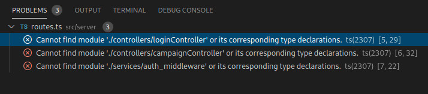
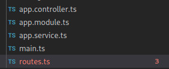

VSCode reports TypeScript errors only from the currently open files. In my opinion, this nearly defeats the purpose of using types in a large codebase. If I were to make a type change in one of my files, which breaks a different module, I want my IDE to flag the error. Intellisense and compile-time error-reporting is a bare minimum requirement of any IDE.

Why VSCode doesn't have this ability out of the box is truly baffling. A quick search reveals an [open issue on the VSCode repo](https://github.com/microsoft/vscode/issues/13953) which hasn't been resolved in over three years! There are some decent workarounds suggested in that thread. I managed to distill that information into a quick recipe.


## Create a TypeScript Watch Task

Create a file called `.vscode/tasks.json` in your workspace:

```json
{
  "version": "2.0.0",
  "tasks": [
    {
      "label": "tsc watch",
      "type": "shell",
      "command": "./node_modules/.bin/tsc",
      "isBackground": true,
      "args": ["--watch", "--noEmit", "--project", "path/to/tsconfig"],
      "group": {
        "kind": "build",
        "isDefault": true
      },
      "presentation": {
        "reveal": "never",
        "echo": false,
        "focus": false,
        "panel": "dedicated"
      },
      "problemMatcher": "$tsc-watch",
      "runOptions": {
        "runOn": "folderOpen"
      }
    }
  ]
}
```

__Note about `type`:__ For a custom task, `type` can either be `shell` or `process` If `shell` is specified, the command is interpreted as a shell command (for example: `bash`, `cmd`, or PowerShell). If `process` is specified, the command is interpreted as a process to execute.


### Auto-Starting the Task

First, automatic tasks must be enabled in VSCode:

1. `Ctrl + Shift + P`
1. Select "Tasks: Manage Automatic Tasks in Folder"
1. Choose "Allow Automatic Tasks in Folder"
1. Close and re-open the workspace

Our `tsc` watch task is set to start automatically when the folder is opened:

```json
"runOn" : "folderOpen"
```

__Ref:__ https://code.visualstudio.com/updates/v1_30#_run-on-folder-open


### Integrating With VSCode's UI

The `problemMatcher` config is used to hook into the output of `tsc`:

```json
"problemMatcher": "$tsc-watch"
```

TypeScript errors from anywhere within the workspace will now be reported in the Problems panel!


<Figure caption="Errors show up in the Problems Panel">



</Figure>

Also, the Explorer panel shows the number of errors next to the file name. Files and folders are colored in red if errors are detected.

<Figure>



</Figure>


## Does Your Project Have Multiple Root Folders?

Mine does. For a multi-root workspace create another file `.vscode/tscwatch.sh`:

```bash
#!/bin/sh
./root1/node_modules/.bin/tsc --watch --noEmit --project root1 &
P1=$!
./root2/node_modules/.bin/tsc --watch --noEmit --project root2 &
P2=$!
wait $P1 $P2
```

`$!` is the PID of the last launched process. Waiting on both PIDs ensures that when the process is killed, both PIDs are killed too.

Next, change `.vscode/tasks.config`:

```json
{
  "version": "2.0.0",
  "tasks": [
    {
      "label": "TS Watch",
      "type": "process",
      "command": "./.vscode/tscwatch.sh",
      "isBackground": true,
      "group": {
        "kind": "build",
        "isDefault": true
      },
      "presentation": {
        "reveal": "never",
        "echo": false,
        "focus": false,
        "panel": "shared"
      },
      "problemMatcher": "$tsc-watch",
      "runOptions": {
        "runOn": "folderOpen"
      }
    }
  ]
}
```

Note the change in task `type`.

Restart VSCode to start off multiple watcher tasks in parallel.

## Too Many Files to Watch?
If there are far too many files in the workspace (tends to happen in a multi-root workspace), your OS could run out of watchers. You'd know when you see an error like this:

```sh
ENOSPC: System limit for number of file watchers reached
```

You can retrieve the current limit for the number of watchers like so:

```sh
cat /proc/sys/fs/inotify/max_user_watches
```

To raise the limit edit `/etc/sysctl.conf` (you'd need root access) and set this the value of `fs.inotify.max_user_watches` to a higher number (max 524288):

```sh
fs.inotify.max_user_watches=524288
```

__Source:__ https://github.com/guard/listen/wiki/Increasing-the-amount-of-inotify-watchers


Apply changes:

```sh
sudo sysctl -p
```
<br/>
<br/>

With these tweaks, VSCode makes writing TypeScript much easier! I can rely on VSCode to slap me on the wrists every time I make a breaking change without needing to run a TypeScript watch in a terminal. I have found this to be a big productivity boost!
